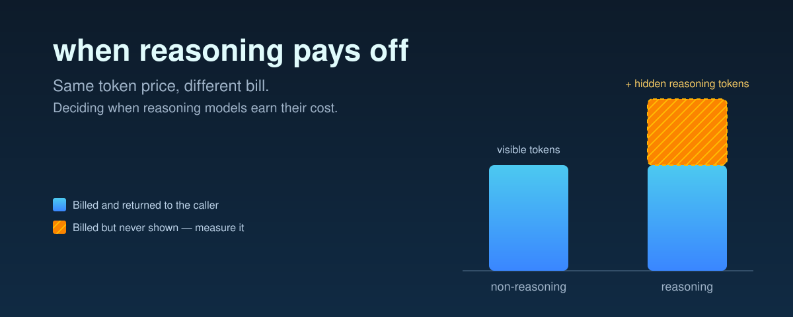
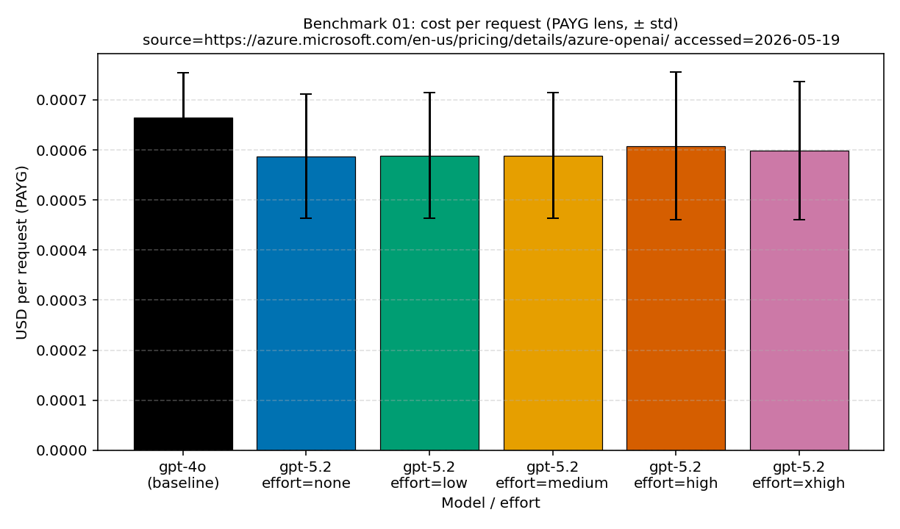
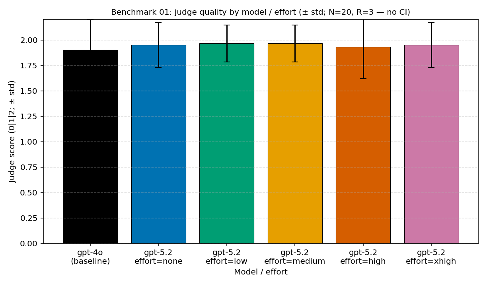

# when-reasoning-pays-off

*Same token price, different bill — a **measured** guide to when reasoning
models earn their cost, and when they just bill for thinking nobody reads.*

[](https://github.com/hyeonsangjeon/when-reasoning-pays-off/actions/workflows/ci.yml) [](https://hyeonsangjeon.github.io/when-reasoning-pays-off/blog/charts/?lang=en) [](https://hyeonsangjeon.github.io/when-reasoning-pays-off/) [](LICENSE) [](https://github.com/hyeonsangjeon/when-reasoning-pays-off/commits/main) [](CONTRIBUTING.md) [](https://github.com/hyeonsangjeon/when-reasoning-pays-off/stargazers)



> [!TIP]
> **▶ Live evidence dashboard** — interactive static charts for reasoning-effort
> cost, latency, throughput, and the PTU↔PAYG crossover, rendered from sanitized
> public data (no live service calls).
> **[Open the dashboard →](https://hyeonsangjeon.github.io/when-reasoning-pays-off/blog/charts/?lang=en)**
> &nbsp;·&nbsp; [한국어](https://hyeonsangjeon.github.io/when-reasoning-pays-off/blog/charts/?lang=ko) · [日本語](https://hyeonsangjeon.github.io/when-reasoning-pays-off/blog/charts/?lang=ja) · [简体中文](https://hyeonsangjeon.github.io/when-reasoning-pays-off/blog/charts/?lang=zh-CN) · [हिन्दी](https://hyeonsangjeon.github.io/when-reasoning-pays-off/blog/charts/?lang=hi)

📖 **Project site:** https://hyeonsangjeon.github.io/when-reasoning-pays-off/ (English, Korean, Japanese, Simplified Chinese, and Hindi).

Start with the [overview essay](https://hyeonsangjeon.github.io/when-reasoning-pays-off/blog/articles/when-reasoning-pays-off/), then drill into the [short factual work topic](https://hyeonsangjeon.github.io/when-reasoning-pays-off/blog/articles/when-reasoning-pays-off/topics/short-factual-work/) or inspect the [evidence dashboard](https://hyeonsangjeon.github.io/when-reasoning-pays-off/blog/charts/?lang=en).

## Generate an offline report in under five minutes

Python 3.11+, no credentials, no service calls, and no telemetry:

```bash
python3 -m venv .venv && . .venv/bin/activate
python -m pip install .
reasoning-payoff analyze examples/five-minute/usage.jsonl \
  --workload examples/five-minute/workload.yaml \
  --out report
```

Open `report/report.html` directly from disk. The same run also creates
`report.json`, `report.md`, and review-only `policy.json`. See the
[numbered method guide](docs/19-five-minute-provenance-report.md) or the
[standalone Pages guide](https://hyeonsangjeon.github.io/when-reasoning-pays-off/guides/five-minute-report/)
([source](docs/guides/five-minute-report/)) for the strict JSONL/YAML
contracts, privacy boundary, interpretation rules, exit codes, and BYOW
workflow.

<!-- CLAIM-INTEGRITY:START current-headlines -->
## TL;DR — what the current measurements say

**The current evidence is workload-specific and descriptive.** In the current
GPT-5.2 short-factual cohort, `none` and `xhigh` cost
**$0.000587 → $0.000598 per request
(1.02x)**, while mean judge quality was **1.95 →
1.95**. Mean reasoning tokens were
**0 at `none`,
1.35 at `high`, and
0.62 at `xhigh`**. The measured floor is
`none`; zero-sample cells are excluded from current public claims.

On the multi-step benchmark, mean judge quality was
**1.5 for the GPT-4o baseline and
2.0 for GPT-5.2 at `none`**. Both the **model** and
**effort** dimensions changed, so this comparison does not isolate an
effort-only causal effect. Within GPT-5.2, `none` already reached the measured
quality ceiling in this cohort; higher effort increased cost without improving
that aggregate score.

| Current short-factual cost | Current short-factual quality |
| --- | --- |
|  |  |

- **Treat effort as a workload-specific tuning parameter, not a quality
  guarantee.** Run an evaluation before changing production policy.
- **Separate model changes from effort changes.** A cross-model comparison is
  useful evidence, but it is not an effort-only experiment.
- **Trace every headline.** The values above resolve through the versioned
  [public claim contract](batch-runner/batch_runner/data/public_claims.v1.json)
  to canonical analysis and public chart JSON.

<sub>Current headline values are generated only inside this marker block.
Historical benchmark, result, and blog inputs remain read-only.</sub>
<!-- CLAIM-INTEGRITY:END current-headlines -->

## Try it in 30 seconds

| You want to… | Do this | Azure needed? |
| --- | --- | :---: |
| **See the evidence** | [Open the live dashboard →](https://hyeonsangjeon.github.io/when-reasoning-pays-off/blog/charts/?lang=en) — interactive cost / quality / latency / crossover charts | ❌ |
| **Read the story** | [Overview essay →](https://hyeonsangjeon.github.io/when-reasoning-pays-off/blog/articles/when-reasoning-pays-off/) in English · 한국어 · 日本語 · 简体中文 · हिन्दी | ❌ |
| **Generate a provenance report** | `reasoning-payoff analyze examples/five-minute/usage.jsonl --workload examples/five-minute/workload.yaml --out report` | ❌ |
| **Verify it runs locally** | `bash scripts/verify_setup.sh` — no credentials, ~10 s to a green check | ❌ |
| **Run the test suite** | `pip install -r requirements-dev.txt && pytest -q -m "not adaptive_calibration" batch-runner/tests/` | ❌ |
| **Reproduce the numbers** | [Reproducing these measurements ↓](#reproducing-these-measurements) | ✅ |

> If this saved you a migration post-mortem, a ⭐ helps other teams find it.

## Contents

- [What this repo is](#what-this-repo-is) · [Terms you will see](#terms-you-will-see)
- [The question](#the-question) · [Short answer](#short-answer) · [Which customer are you?](#which-customer-are-you)
- [What's here](#whats-here) — [docs](#documentation), [code and data](#code-and-data)
- [Five-minute offline report](#generate-an-offline-report-in-under-five-minutes) · [Method guide](docs/19-five-minute-provenance-report.md)
- [Operator levers (L1–L5)](#operator-levers-l1l5) · [Methodology](#methodology-summary) · [Reproducing](#reproducing-these-measurements)
- [Data publication policy](#data-publication-policy) · [Contributing, governance, security](#contributing-governance-security)

## What this repo is

When teams move a workload from a non-reasoning model (e.g. GPT-4o) to a
**reasoning model** like GPT-5.2, the bill often goes up even though the
per-token prices look similar. The reason: reasoning models charge for
"thinking" — internal reasoning tokens that are billed but never appear in the
response. This repo measures, on a small set of representative tasks, when
those extra reasoning tokens are worth the cost and when they are not, and
publishes the raw measurement scripts so you can rerun them on your own
deployment.

**Who this is for.** Engineers and architects running an Azure OpenAI
deployment who are trying to decide whether (and how much) reasoning to enable,
size capacity, or debug a cost / latency / throttling change after a model
migration.

> **Research artifact with a stable offline tool boundary.** This repository
> publishes reproducible benchmarks, methodology, sanitized result slices, and
> the versioned `reasoning-payoff init / analyze / report` interface. The CLI
> is credential-free and local; there is no hosted service, live-provider
> command, uploader, telemetry server, or SLA. See
> [`SUPPORT.md`](SUPPORT.md), [`SECURITY.md`](SECURITY.md), and
> [`docs/16-release-tiers-and-redaction-policy.md`](docs/16-release-tiers-and-redaction-policy.md)
> for scope, security reporting, and how published data is sanitized.

## Terms you will see

| Term | Plain-language meaning |
| --- | --- |
| **Reasoning model** | A model that runs internal reasoning steps before producing a visible response (e.g. GPT-5.2). Those internal tokens are billed at the output rate but never returned to the caller. |
| **`reasoning_effort`** | Per-request knob whose supported values vary by model and API (`none`, `minimal`, `low`, `medium`, `high`, `xhigh`, and newer-model `max` are possible). Treat it as a measured tuning input, not a quality guarantee. |
| **PAYG** (Pay-As-You-Go) | Consumption-based pricing on Azure OpenAI: billed per uncached input token, cached input token (at a lower rate), and output token actually used. Reasoning tokens are charged at the output rate. |
| **PTU** (Provisioned Throughput Units) | Pre-paid, reserved capacity on Azure OpenAI: billed by the hour for a fixed throughput budget, independent of token volume. Once you have bought PTU, reducing tokens per request does not lower the bill — it lets the same capacity serve more traffic. |
| **HTTP 429** | The "too many requests" / capacity-rejection response the service returns when a deployment is over its rate or PTU budget. We refer to "429 onset" as the request rate at which 429s start appearing. |
| **Prompt cache / cached input** | Azure OpenAI bills the cached portion of an input prompt at a lower rate. A single byte change to the **cacheable prefix** — typically the system prompt or tool-definition block — invalidates that prefix until it re-warms. |
| **Single-call ReAct** | A workflow in which one large model call plans, reasons over tool definitions and retrieval context, and synthesizes the answer, instead of splitting the task across several smaller orchestration calls. The shape of the prompt (tools, schemas, retrieval) becomes part of the cacheable prefix. |
| **Operator lever (L1–L5)** | Five operational knobs an engineer can change on a live deployment without re-architecting it. Defined in [`docs/09-operator-guide-one-page.md`](docs/09-operator-guide-one-page.md) and summarized [below](#operator-levers-l1l5). |
| **Release tier** (`SANITIZED_PUBLIC`, `RAW_PRIVATE`, `AGGREGATE_AZURE_SAMPLE`) | Labels on every published artifact saying how it was processed before publication. See [Data publication policy](#data-publication-policy). |

## The question

GPT-4o → GPT-5.2 migrations often show rising token costs because reasoning
models charge for invisible internal reasoning tokens. The question is not
whether reasoning models are useful (they are), but **when their cost is
justified**. This repo measures that question with reproducible benchmarks.

## Short answer

- Reasoning tokens are billed but do not appear in the response. **Always
  measure them.** Every benchmark in this repo captures the full
  `response.usage` object — input, cached, reasoning, and output tokens
  separately.
- Not every task benefits from reasoning. Short factual answers,
  structured-input-to-natural-language synthesis, and simple classification
  often do not need it.
- `reasoning_effort` support is model-specific. Start from the lowest supported
  level and raise it only when a task-specific quality evaluation justifies it.
- Prompt caching behaves differently on reasoning models. Why the hit ratio
  changes depends on the **architecture** (multi-node orchestration vs
  single-call ReAct) and on the **billing model** (PAYG vs PTU). The repo
  enumerates testable hypotheses in
  [`docs/07-cache-hit-degradation.md`](docs/07-cache-hit-degradation.md).
- On **PAYG**, cutting reasoning tokens directly reduces the bill. On **PTU**,
  the same cut is a throughput gain at a fixed bill. The repo measures both.
- At scale, the architectural answer is to route different task types to
  different effort levels — regardless of billing model.

## Which customer are you?

**PAYG users.** You are billed per token. Reducing tokens reduces your bill.
The cost curves under [`results/cost-curves/`](results/cost-curves/) show the
dollar delta per request at each effort level.

**PTU users.** You are billed for a fixed capacity budget. Reducing tokens does
not change your bill — it lets the same PTU capacity serve more requests, and
it cushions latency spikes during peak load. PTU users investigating cache hit
drops or earlier 429 onset after migrating to a reasoning model should read
[`docs/07-cache-hit-degradation.md`](docs/07-cache-hit-degradation.md).
`docs/07` ranks nine candidate causes from most to least useful for diagnosis.
Three to look at first for a PTU + reasoning migration are:

- **Capacity reservation from `max_output_tokens`** — `max_output_tokens` acts
  as an admission-time PTU reservation, not a soft cap. Inflating it to give
  reasoning headroom silently lowers how many concurrent requests the
  deployment can admit, so 429s appear at a lower request rate while the bill
  per completed request is unchanged.
- **Load-correlated prompt-cache dip** — a transient dip in cache hit ratio
  while a PTU deployment is running near saturation, which recovers as load
  drops. It is a load-correlated effect, not a permanent change.
- **Cacheable-prefix shape change during single-call ReAct migration** — the
  input side of the prompt changes shape during a single-call ReAct migration
  (tool definitions, structured-output schemas, retrieval context placement)
  and that changes the cacheable prefix even if the user-visible system prompt
  did not.

Of these, only the **load-correlated prompt-cache dip** has direct in-repo
measurement so far; the **capacity reservation from `max_output_tokens`** and
the **cacheable-prefix shape change during single-call ReAct migration** are
mechanism-backed diagnostic hypotheses with recipes in `docs/07` rather than
measured magnitudes.

## What's here

### Documentation

| Doc | Topic |
| --- | --- |
| [`docs/04-decision-framework.md`](docs/04-decision-framework.md) | Task → effort decision framework |
| [`docs/05-methodology.md`](docs/05-methodology.md) | How we measured (the reproducibility contract — frozen) |
| [`docs/07-cache-hit-degradation.md`](docs/07-cache-hit-degradation.md) | Hypotheses for cache hit ratio drop on reasoning models |
| [`docs/08-customer-simulation-findings.md`](docs/08-customer-simulation-findings.md) | PTU + single-call ReAct: pattern, mechanisms, leverages |
| [`docs/09-operator-guide-one-page.md`](docs/09-operator-guide-one-page.md) | Operational quick-reference (operator levers L1–L5 for PTU + reasoning) |
| [`docs/10-ptu-admission-controller.md`](docs/10-ptu-admission-controller.md) | Header-driven admission controller design |
| [`docs/11-multi-worker-cooldown.md`](docs/11-multi-worker-cooldown.md) | Multi-worker cooldown coordination |
| [`docs/12-prompt-cache-key-policy.md`](docs/12-prompt-cache-key-policy.md) | `prompt_cache_key` policy library + sizing runbook |
| [`docs/13-ptu-vs-payg-decision-runbook.md`](docs/13-ptu-vs-payg-decision-runbook.md) | PTU vs PAYG decision calculator + runbook |
| [`docs/14-observability-schema.md`](docs/14-observability-schema.md) | Canonical per-request / per-cell record contract |
| [`docs/15-spec-vs-inference-taxonomy.md`](docs/15-spec-vs-inference-taxonomy.md) | Two-tier citation taxonomy (Tier 1 official spec vs Tier 2 operational inference) |
| [`docs/15-spec-vs-inference-taxonomy.examples.md`](docs/15-spec-vs-inference-taxonomy.examples.md) | Worked examples of the citation taxonomy |
| [`docs/16-release-tiers-and-redaction-policy.md`](docs/16-release-tiers-and-redaction-policy.md) | Three-tier release classification and redaction rules |
| [`docs/17-foundry-packaging-relationship.md`](docs/17-foundry-packaging-relationship.md) | Publication boundaries and Azure AI Foundry packaging contract |
| [`docs/18-agentic-loop-budget-governance.md`](docs/18-agentic-loop-budget-governance.md) | Operator lever L6 — governing unbounded agentic loops (thresholds, intervention, evals, traceability, governance) |
| [`docs/19-five-minute-provenance-report.md`](docs/19-five-minute-provenance-report.md) | Official offline CLI method: install, sample/BYOW contracts, artifacts, privacy, interpretation, exit codes, and timing |
| [Standalone five-minute Pages guide](https://hyeonsangjeon.github.io/when-reasoning-pays-off/guides/five-minute-report/) | Dependency-free web rendering of the same command and contract guide |

### Code and data

- [`batch-runner/`](batch-runner/) — Python library and official
  `reasoning-payoff` CLI: strict usage/workload contracts, deterministic local
  reports, decision calculators, observability schema, and release-tier helpers.
- [`scripts/`](scripts/) — Measurement, public-data generation, and article
  publication pipeline. Start with [`scripts/README.md`](scripts/README.md).
- [`benchmarks/`](benchmarks/) — Per-task measurement targets with sanitized
  run captures and per-target analysis. Tier classification per `docs/16`.
- [`results/`](results/) — Cross-benchmark synthesis and charts. See
  [`results/summary.md`](results/summary.md),
  [`results/public/chart-data/README.md`](results/public/chart-data/README.md),
  and [`results/supplementary/README.md`](results/supplementary/README.md).
- [`scripts/article_topics/`](scripts/article_topics/) — Article-topic registry
  that maps public articles to generators, input evidence, sample units, and
  output contracts.
- [`schemas/`](schemas/) — JSON Schemas for the observability and
  release-manifest record contracts.
- [`pricing/`](pricing/) — Pricing snapshots used by the cost calculator (PAYG
  and PTU density tables).
- [`release/public_sanitized_manifest.json`](release/public_sanitized_manifest.json)
  — the **release manifest**: for every published artifact, the SHA-256 of the
  sanitized file and the SHA-256 of the original raw source it derives from.

## Operator levers (L1–L5)


<sub>*The same burst of requests, two outcomes: without a limiter the API sheds load as 503; with a token-bucket limiter, over-limit requests get a **429 returned to the caller** so the API stays healthy. **L2** below is where you choose that spillover behavior.*</sub>

If you operate a live deployment, [`docs/09-operator-guide-one-page.md`](docs/09-operator-guide-one-page.md)
is the one-page reference. The six levers, in plain English (L1–L5 tune a single call or deployment; **L6** governs the multi-call loop):

| Lever | What you change | Why it matters |
| --- | --- | --- |
| **L1** First-token timeout | Per-deployment `first_token_timeout_ms` (e.g. `3000`) | Decides how long a request waits while the primary is saturated before the client gives up or reroutes. Shorter timeouts shrink tail latency in the saturated window. |
| **L2** Spillover policy | Native Azure spillover vs custom proactive router | Native spillover reacts to 429s on a PTU primary; a custom router can act earlier but generates extra 429s when its heuristic mis-fires. Pick based on topology, not preference. |
| **L3** System-prompt stability | Track `sha256(system_prompt)` per request and alarm on unintended changes | A single byte change flushes the prompt cache, so the next requests bill the full input rate until the cache re-warms. Migration-era "cache hit dropped" symptoms often resolve to this. |
| **L4** Reasoning effort tuning | Per-task `reasoning_effort` default | Higher effort spends more reasoning tokens without necessarily lifting quality. Default new traffic to `minimal` (or `none` where supported); raise only where measured quality justifies it. |
| **L5** `max_output_tokens` tightening | Tighten the per-call cap to `ceil((p99_visible + p99_reasoning) × 1.15)` | On PTU, this value is an admission-time reservation. Inflated caps silently reduce concurrency and pull 429 onset earlier. |
| **L6** Loop / budget governance | Per-task step cap + cumulative cost ceiling, a fail-closed circuit-breaker, eval-gated continuation, and per-step cost traceability | L1–L5 bound a single call; **L6 bounds the loop.** Caps runaway agentic spend, makes per-loop cost traceable, and intervenes before overrun. See [`docs/18`](docs/18-agentic-loop-budget-governance.md). |

Full mechanism, evidence, and Azure docs links for each lever are in
[`docs/09`](docs/09-operator-guide-one-page.md). L6's full treatment — step
caps, cost ceilings, the circuit-breaker, eval-gated escalation, and per-step
traceability — is in
[`docs/18-agentic-loop-budget-governance.md`](docs/18-agentic-loop-budget-governance.md).

## Methodology summary

We use three benchmark task types representative of common use cases. For each,
we sweep `reasoning_effort` across its full ladder of tiers and run multiple
repeats per (sample, effort) combination. We capture the full `response.usage`
object — input, cached, reasoning, and output tokens separately — and pair
token measurements with a quality evaluation.

Detailed methodology: [`docs/05-methodology.md`](docs/05-methodology.md).

## Reproducing these measurements

**No Azure account is needed for anything here except the final, optional live
re-run.** Three tiers, cheapest first.

### Tier 0 — read the evidence (nothing to install)

The [live dashboard](https://hyeonsangjeon.github.io/when-reasoning-pays-off/blog/charts/?lang=en),
[`results/summary.md`](results/summary.md), and the committed `runs/` +
`analysis.md` under each [`benchmarks/`](benchmarks/) directory already contain
every published number.

### Tier 1 — run it locally, no cloud account

```bash
git clone https://github.com/hyeonsangjeon/when-reasoning-pays-off.git
cd when-reasoning-pays-off

# Python 3.11+ required. If `python` is missing, use `python3` everywhere below.
python3 -m venv .venv && . .venv/bin/activate     # Windows: .venv\Scripts\activate
python -m pip install .

# Generate the four-artifact provenance bundle:
reasoning-payoff analyze examples/five-minute/usage.jsonl \
  --workload examples/five-minute/workload.yaml \
  --out report
```

Open `report/report.html`, then explore or dry-run any experiment — still no
cloud account and no tokens spent:

```bash
python experiments/examples/describe_all.py       # the full input → variable → output catalog
python experiments/examples/pure_functions.py     # the deterministic primitives, zero network
python -m scripts.run_benchmark \
  --experiment experiments/exp001_short-factual_baseline.yaml --dry-run --allow-dirty
```

Run the unit-test suite (add the dev tools first):

```bash
pip install -r requirements-dev.txt
pytest -q -m "not adaptive_calibration" batch-runner/tests/
```

> A normal `pip install .` exposes the official CLI and keeps the packaged
> `init` resources available outside the repository. Editable install remains
> suitable for contributors; measurement runners are still invoked as
> `python -m scripts.<runner>` from the repository root.

### Tier 2 — re-run the benchmarks against a live model (Azure required)

This needs Azure OpenAI access with a **GPT-5.2 deployment**. The repo uses
**Entra ID authentication** — no API keys in `.env`; run `az login` once and the
cached token is auto-refreshed by `DefaultAzureCredential`.

```bash
az login                       # one-time
cp .env.example .env           # then edit the endpoint + deployment names

# Drop --dry-run to spend real tokens. Every runner takes --experiment <yaml>:
python -m scripts.run_benchmark --experiment experiments/exp001_short-factual_baseline.yaml
```

See [`experiments/README.md`](experiments/README.md) for the full input →
variable → output catalog, the blog-article ↔ experiment map, and a one-call
Python interface (`experiments.run(...)`) that picks the right runner for you.

## Status

Per-benchmark status, run reports, and per-target analyses live under
[`benchmarks/`](benchmarks/) — each directory carries its own `RUN_REPORT.md`
and `analysis.md`. The cross-benchmark synthesis is at
[`results/summary.md`](results/summary.md).

## Data publication policy

Every artifact published from this repository carries one of three **release
tiers**, defined fully in
[`docs/16-release-tiers-and-redaction-policy.md`](docs/16-release-tiers-and-redaction-policy.md):

- **`RAW_PRIVATE`** — the original, unmodified run output. Kept in a private
  owner-controlled archive and **never** published from this tree.
- **`SANITIZED_PUBLIC`** — a sanitized derivative of a raw run. The scientific
  content is preserved; sensitive fields (e.g. deployment names, internal
  hostnames) are redacted or pseudonymized.
- **`AGGREGATE_AZURE_SAMPLE`** — aggregate-only exports. No per-request rows.

For every sanitized file we publish, the **release manifest**
[`release/public_sanitized_manifest.json`](release/public_sanitized_manifest.json)
records the SHA-256 of the published bytes and the SHA-256 of the original raw
source it derives from. The raw source is preserved, not deleted, so any
published result can be traced back to its untouched origin if questioned.

## Contributing, governance, security

- [`CONTRIBUTING.md`](CONTRIBUTING.md) — how to file issues and PRs.
- [`GOVERNANCE.md`](GOVERNANCE.md) — single-owner model with documented
  escalation for frozen artifacts.
- [`CODE_OF_CONDUCT.md`](CODE_OF_CONDUCT.md) — Contributor Covenant 2.1.
- [`SECURITY.md`](SECURITY.md) — how to report a security or data-leakage issue
  (please do **not** open a public issue for these).
- [`SUPPORT.md`](SUPPORT.md) — scope and response expectations.

## License

[MIT](LICENSE)
