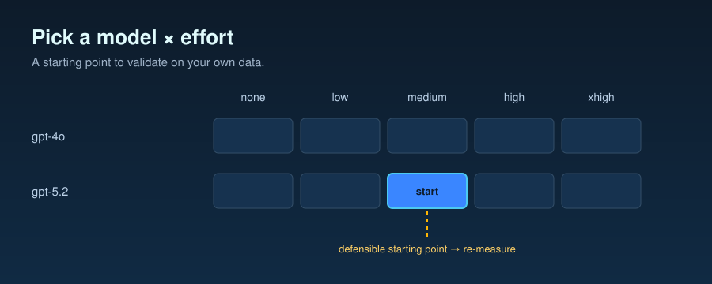

# Decision Framework — Pick a Model × Effort for Your Task

## 1. Who this is for

A customer engineer or applied scientist evaluating an Azure OpenAI
workload and deciding between **gpt-4o** and **gpt-5.2** at one of the
five effort levels (`none`, `low`, `medium`, `high`, `xhigh`). You have a
task description, a rough cost budget, and a consumption-model
constraint (PAYG or PTU). You want a defensible starting point and a
plan for confirming it on your own data.

This document **is**:

- A routing rule grounded in three measured benchmarks
- A starting point — the recommendation you should validate on your data
- An honest accounting of where the framework breaks

This document **is not**:

- A model evaluation ("gpt-5.2 is better than gpt-4o at X") — the
  measured benchmarks have specific shapes; your task is not one of them
- A universal claim — every recommendation cites the per-benchmark
  evidence; deviations from those task shapes deserve their own
  measurement
- A substitute for a smoke test on your real workload

## 2. The 3-question decision tree

### Q1 — Does your task need multi-step inference?

**Multi-step** means the answer requires chaining ≥ 2 inferential steps
that gpt-4o has been observed to occasionally drop — arithmetic word
problems, constraint-satisfaction puzzles, code-trace under aliasing,
inclusion-exclusion counting, multi-hop date arithmetic, multi-step
causal chains. (See
[`benchmarks/02-multi-step-reasoning/dataset.json`](../benchmarks/02-multi-step-reasoning/dataset.json)
for ~20 worked examples.)

- **No.** Your task is a benchmark-01 shape (short-factual, classification,
  formatting). Reasoning is unnecessary — but on PAYG, gpt-5.2 `none`
  (no reasoning) is the pick:
  [`benchmarks/01-short-factual/analysis.md` §5](../benchmarks/01-short-factual/analysis.md)
  shows it runs ~12 % cheaper per request than gpt-4o at parity-or-better
  quality (95 % vs 90 % pass) with no latency penalty (latency shows no
  effort trend). On fixed-capacity PTU raw throughput is a wash (0.989 ×),
  and gpt-5.2 `none`'s higher pass-rate keeps it at parity-or-better on
  quality-adjusted throughput — so `none` stays the pick on both
  consumption models. Either way, don't dial effort above `none`.
- **Yes — but the task is single-shot (no tool calls).** Go to Q3
  (consumption model).
- **Yes — and the task uses tools.** Go to Q2.

### Q2 — Does your task use tools?

If yes, characterize the workload's per-call mix:

- **Mostly no-tool / one-tool calls** (≥ 70 % of production traffic
  invokes 0 or 1 tools): the benchmark-03 evidence (per-subtype
  pass-rate, [§7](../benchmarks/03-tool-using-agent/analysis.md)) shows
  gpt-4o falls to 83.3 % on the no-tool subset — the model over-uses
  the calculator on prompts that explicitly ask for general-knowledge
  answers. Every gpt-5.2 cell holds 100 % on the same no-tool subset
  and 100 % on the one-tool subset.
  **Pick gpt-5.2 `low`** (or `none` if latency-sensitive) — both deliver
  100 % no-tool / 100 % one-tool pass-rate at ~$0.00277 / correct, vs
  gpt-4o's $0.00365 / correct at 90 % aggregate pass-rate.
- **Mostly multi-tool calls** (≥ 50 % chain 2+ tools): gpt-4o falls to
  83.3 % multi-tool pass-rate
  ([03 §7](../benchmarks/03-tool-using-agent/analysis.md)). **Pick
  gpt-5.2 `low`** as the production default (100.0 % multi-tool
  pass-rate at $0.002773 / correct; +16.7 percentage points vs gpt-4o,
  24 % cheaper per-correct;
  [03 §5](../benchmarks/03-tool-using-agent/analysis.md)). **Never pick
  `high` or `xhigh`** — quality saturates at `low` on the measured
  benchmark, and `xhigh` is 26 % more expensive per-correct than `low`
  at identical pass-rate.
- **Mixed (30 / 40 / 30 split)** matching the benchmark 03 distribution:
  see the aggregate cost-per-correct table in
  [`benchmarks/03-tool-using-agent/analysis.md` §5](../benchmarks/03-tool-using-agent/analysis.md).
  PAYG-aggregate winner is **gpt-5.2 `low`** at $0.002773 / correct
  (gpt-4o is $0.003651 / correct — 24 % more expensive).

### Q3 — PAYG or PTU?

The same workload's recommendation may differ across consumption models —
though on the workloads measured here the two lenses largely agree on
gpt-5.2 `low` or `none`.

- **PAYG (pay-as-you-go; per-token billing):** the cost-per-correct
  table is the bill. Pick the cell with the lowest
  `mean_usd_per_cell / pass_rate` for your workload shape:
  - Short-factual (benchmark 01): **gpt-5.2 `none`** — ~12 % cheaper
    per request than gpt-4o at parity-or-better quality
    ([01 §5](../benchmarks/01-short-factual/analysis.md)).
  - Multi-step reasoning (benchmark 02): **gpt-5.2 `none`** —
    $0.000618/correct vs $0.001064 (gpt-4o), **42 % saving**
    ([02 §5](../benchmarks/02-multi-step-reasoning/analysis.md)).
  - Tool-using (benchmark 03): **gpt-5.2 `low`** — $0.002773/correct
    vs $0.003651 (gpt-4o), **24 % saving**
    ([03 §5](../benchmarks/03-tool-using-agent/analysis.md)).

- **PTU (provisioned throughput; fixed-capacity billing):** the
  correct-answers-per-minute lens replaces the cost-per-correct lens.
  Throughput is the lever; you cannot save dollars (your bill is fixed)
  but you can shrink the workload's throughput footprint.
  - Short-factual (benchmark 01): **gpt-5.2 `none`** — raw throughput is
    a wash (0.989 × vs gpt-4o), and its higher pass-rate (95 % vs 90 %)
    nets **+4.4 % correct-answers-per-minute**
    ([01 §6](../benchmarks/01-short-factual/analysis.md)).
  - Multi-step reasoning (benchmark 02): **gpt-5.2 `none`** — same as
    PAYG. Throughput-gain = 0.994 × at 100 % pass-rate vs gpt-4o
    baseline → +32.5 % correct-answers-per-minute at fixed PTU spend
    ([02 §6](../benchmarks/02-multi-step-reasoning/analysis.md)).
  - Tool-using (benchmark 03): **gpt-5.2 `low`** — 0.939 × throughput ×
    100.0 % pass = **+4.3 % correct-answers-per-minute** relative to
    the gpt-4o baseline (1.0 × × 90.0 %);
    [03 §6](../benchmarks/03-tool-using-agent/analysis.md).
  - **PTU upsize is still an option for stricter quality budgets.** If
    a customer wants gpt-5.2 `medium` or above on a tool-using workload
    despite the slight throughput regression vs `low`, upsize the PTU
    allocation by ~10 % (medium runs at 0.915 × vs `low`'s 0.939 ×) —
    but the measurement here says `low` is already the optimal point
    on every lens.

## 3. Worked examples

### Example A — RAG factoid endpoint

> A customer is running a retrieval-augmented short-Q&A endpoint. Each
> call retrieves 2–3 passages and asks gpt-4o for a 1–2 sentence answer.
> Volume = 50 k req/day on PAYG. They want to know if gpt-5.2 saves money.

- Q1: Multi-step inference? **No** — the model is doing extraction +
  paraphrase, not chained inference. Task shape ≈ benchmark 01
  (short-factual, null case).
- Q3: **PAYG**.
- **Recommendation:** **gpt-5.2 `none`** — saves $0.000078 per call
  vs gpt-4o ([01 §5](../benchmarks/01-short-factual/analysis.md)), at
  parity-or-better pass-rate (95 % vs 90 %, within small-N noise). That
  per-call saving scales linearly with the customer's volume (multiply the
  sourced per-call delta by the daily call count). No latency trade-off:
  latency shows no effort trend on this benchmark
  ([01 §8](../benchmarks/01-short-factual/analysis.md)); still confirm
  against p95 SLO before flipping production.
- Confirm-on-your-data plan: run 200 representative queries through both
  models, judge with the same gpt-4o judge prompt, verify pass-rate
  parity and latency tolerance.

### Example B — Multi-tool workflow agent

> A customer is building a workflow agent that retrieves CRM data, does
> arithmetic on it, and generates a follow-up email. Each call invokes
> 2–4 tools (search + calculator + sometimes a notification API). Volume
> = 5 k req/day on a PTU allocation sized to their workload.

- Q1: Multi-step inference? **Yes**.
- Q2: Tools? **Yes — multi-tool dominated.**
- Q3: **PTU**.
- **Recommendation:** **gpt-5.2 `low`**. Benchmark 03 measured this
  shape: gpt-5.2 `low` delivers 100.0 % multi-tool pass-rate at
  0.939 × gpt-4o throughput, i.e. **+4.3 % correct-answers-per-minute**
  vs gpt-4o (which scores 83.3 % on multi-tool at 1.0 × throughput)
  ([03 §6, §7](../benchmarks/03-tool-using-agent/analysis.md)). For a
  workflow agent where multi-tool failures are unacceptable, gpt-5.2
  `low` is the defensible default at the SAME PTU capacity. The
  cost-per-correct framing on the customer's PAYG equivalent would be
  $0.002773 vs $0.003651 — 24 % savings if they ever flip to PAYG.
- Confirm-on-your-data plan: measure the customer's actual multi-tool
  fraction (their CRM workflow may be less multi-tool-heavy than the
  benchmark 03 mix). Validate that `gpt-5.2 low` holds 100 % on the
  customer's own multi-tool samples — if it drops, escalate to `medium`
  and re-measure.

### Example C — Math homework helper

> A customer is building a math-tutoring product. Each query is a multi-
> step word problem (arithmetic, constraint-satisfaction, geometric
> series). No tools. Volume = 200 k req/day on PAYG. They want the
> lowest cost-per-correct.

- Q1: Multi-step inference? **Yes**.
- Q2: Tools? **No.**
- Q3: **PAYG**.
- **Recommendation:** **gpt-5.2 `none`**. Benchmark 02 measured exactly
  this shape: gpt-5.2 `none` delivers 100 % pass-rate at $0.000618/correct
  vs gpt-4o's $0.001064 (75 % pass-rate;
  [02 §5](../benchmarks/02-multi-step-reasoning/analysis.md)) — a lower
  cost-per-correct AT HIGHER QUALITY, and that per-correct advantage
  scales linearly with the customer's 200 k req/day volume. Bonus: the
  latency cost is ~15 % over gpt-4o
  ([02 §8](../benchmarks/02-multi-step-reasoning/analysis.md)) — well
  within typical SLOs. Do NOT bump effort above `none`; benchmark 02
  shows every tier above `none` increases cost-per-correct without
  lifting pass-rate.
- Confirm-on-your-data plan: pick 100 queries spanning the customer's
  actual subtype mix, run both gpt-4o and gpt-5.2 `none`, verify the
  pass-rate gap holds. If the customer's dataset is easier (gpt-4o
  pass-rate above ~85 %), the dollar saving shrinks but gpt-5.2 `none`
  remains the right pick. The benchmark 02 README "Pre-registered range
  deviation" section
  ([02 §10](../benchmarks/02-multi-step-reasoning/analysis.md))
  documents an instance where this caveat fired.

## 4. When the framework does NOT apply

The framework is grounded in three benchmarks with specific task shapes
and a single pricing snapshot. It will **not** generalize cleanly to:

- **Long-form generation** (essays, reports, code generation > 200
  tokens). None of the benchmarks measure long-output workloads. The
  reasoning-token cost scaling on `high` / `xhigh` may invert for tasks
  where reasoning tokens are amortized over long visible outputs.
- **Multimodal tasks** (vision, audio). Not measured.
- **Function-calling beyond simple calculator + lookup** (database
  writes, API mutations with side effects). Benchmark 03's tool surface
  is intentionally minimal; real-world tool surfaces with retries,
  rate-limits, and partial-failure recovery may dominate the cost / quality
  shape in ways not captured here.
- **Real-time / sub-1-second SLOs.** On reasoning-heavy shapes
  (benchmarks 02 / 03) higher effort tiers add latency as reasoning tokens
  grow; on the null case (benchmark 01) latency shows no effort trend
  ([01 §8](../benchmarks/01-short-factual/analysis.md)). Latency-bound
  workloads should measure time-to-first-token directly before dialing
  effort up.
- **PTU workloads with parallel batches / streaming.** The
  throughput-gain figures here are derived from token counts only — they
  do not account for queueing, batch composition, or rate-limit shaping.
- **Workloads where gpt-4o's failure modes are silent.** If a
  classification or formatting task can produce a "confidently wrong"
  output that downstream systems can't detect, the cost-per-correct
  framing understates the cost of failure (recovery cost, brand cost,
  liability cost are not measured here).
- **Pricing has moved.** The framework assumes the
  `pricing/azure-openai-payg-2026-05.yaml` snapshot. When Azure
  publishes a new rate, re-run the analyses against the refreshed
  snapshot and re-check every cell in §2 / §3.

## 5. Open questions / future measurements

- **Effort < `none`?** Foundry v1 gpt-5.2 rejects `minimal` with HTTP
  400 (per Task 006 finding documented in
  [`scripts/run_benchmark.py`](../scripts/run_benchmark.py)); `none` is
  the lowest accepted level. If a future API version restores `minimal`
  for gpt-5.2 the cost-per-correct floor on benchmark 02 may shift.
- **PTU live-load measurement.** The throughput-gain figures here are
  derived from mean tokens-per-request. A real PTU load test would
  measure queueing, p95 latency under load, and actual
  correct-answers-per-second. Out of scope for the current repo;
  high-value future work.
- **Workload-mix sensitivity (benchmark 03).** The headline
  cost-per-correct depends on the 30 / 40 / 30 subtype mix. A workload
  that is 80 % multi-tool would shift the aggregate winner further
  toward gpt-5.2 `low`; a workload that is 90 % no-tool would tighten
  the gap (since gpt-5.2 `low` and gpt-5.2 `none` tie on no-tool).
  Customers should measure their own subtype mix before applying the
  framework's aggregate recommendation.
- **Prompt-caching effects.** All three benchmarks measure cold-prefix
  shape (cached_tokens ≈ 0 across cells); warm-cache savings could
  flip the per-correct ranking on long-system-prompt workloads, but
  the measurement is not in this repo.
- **Real-world tool surfaces.** Benchmark 03's two tools (calculator +
  canned web_search) are intentionally minimal so the analysis is
  reproducible. Production tool surfaces — database writes, API
  mutations with side effects, retries with stateful systems — may
  dominate the cost / quality shape in ways not measured here. The
  framework's "gpt-5.2 low for tool-using" recommendation should be
  validated against the customer's own tool surface, not assumed to
  carry over.
