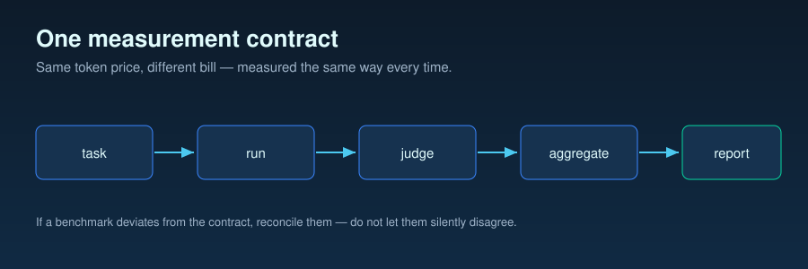

# Methodology

> *Same token price, different bill.* This document is the measurement contract for every
> benchmark in this repo. If a benchmark deviates from what is written here, either the
> benchmark is wrong or this document is — fix one, do not silently disagree.



The audience is an engineer with Azure OpenAI access who wants to reproduce, audit, or
extend the numbers reported in `benchmarks/*/analysis.md` and `results/summary.md`. The
voice is deliberately neutral: we are not arguing that reasoning models are good or bad,
only measuring *when* they earn their token cost.

---

## 1. Goal

We answer one question, three times, across three task profiles:

> Given a task, does increasing `reasoning_effort` on GPT-5.2 produce enough quality lift
> to justify the additional billed tokens?

Concretely, every benchmark produces:

1. A **token decomposition** per effort level — input, cached, reasoning, output —
   captured from `response.usage`, not estimated.
2. A **quality score** per (sample, effort) pair from an independent judge model plus
   manual spot-checks.
3. A **cost per call** in USD using the dated pricing snapshot committed under `pricing/`.
4. A **decision implication** — for this task profile, which effort level is on the Pareto
   frontier of cost vs. quality.

We deliberately do *not* try to produce a single "best effort level." The answer depends
on the task, and the contribution of this repo is the per-task evidence.

### Non-goals

- We do not benchmark GPT-5.2 against other vendors. The repo is about *within-model*
  decisions for teams already on GPT-5.2.
- We do not measure throughput under load. This is a per-call economics study, not a
  capacity test.
- We do not optimize prompts. Prompts are frozen per benchmark so the only thing varying
  is `reasoning_effort`.

---

## 2. Variables

A measurement is only as reliable as its variable control. Each call we make has exactly
one independent variable; everything else is held constant or recorded.

### Independent variable

| Variable | Values | Where it is set |
| --- | --- | --- |
| `reasoning_effort` | `none`, `low`, `medium`, `high`, `xhigh` | `reasoning={"effort": ...}` on `client.responses.create()` |

We pass the effort explicitly on every call. We never rely on deployment defaults — a
deployment-side change would silently invalidate every prior result.

### Dependent variables (measured per call)

| Variable | Source | Notes |
| --- | --- | --- |
| `input_tokens` | `usage.input_tokens` | Total billable input |
| `cached_tokens` | `usage.prompt_tokens_details.cached_tokens` | Cache-hit portion of input |
| `reasoning_tokens` | `usage.completion_tokens_details.reasoning_tokens` | Invisible, billed thinking |
| `output_tokens` | `usage.output_tokens` minus reasoning | Visible response tokens |
| `latency_ms` | Wall-clock around the application programming interface (API) call | End-to-end, including network |
| `response_text` | `response.output_text` | Required for quality eval |
| `quality_score` | Judge model, later pass | 0–1 scalar, rubric per benchmark |

`response.usage.model_dump()` is captured wholesale on every call. If Azure ships a new
field tomorrow, we will already have it in the raw run JSON without re-running anything.

### Controlled variables (held constant within a benchmark)

| Variable | Value source |
| --- | --- |
| System prompt | `benchmarks/<name>/prompts/system.md`, byte-identical across efforts |
| User prompt template | Defined per sample in `dataset.json`, byte-identical across efforts and repeats |
| `model` (deployment) | `AZURE_OPENAI_DEPLOYMENT_GPT_5_2`, one deployment per benchmark run |
| `api_version` | `2025-03-01-preview` (Responses API) |
| `temperature` | Set per benchmark, recorded in the experiment YAML |
| `top_p` | Set per benchmark, recorded in the experiment YAML |
| `max_output_tokens` | Set per benchmark, large enough that no run is truncated |

Cache invalidation is sensitive — even a single character change in the system prompt
flushes the cache and would make cross-effort comparisons meaningless. Any prompt edit
forces a new experiment ID and a re-baseline.

### Recorded but not controlled

| Variable | Why we record it |
| --- | --- |
| `timestamp` (UTC ISO-8601) | Trace back to a specific run, correlate with cache state |
| `git_commit` | Pin code state that produced the result |
| `deployment` (string) | Deployment names can encode region/version |
| Cold-start flag | First call after deployment idle has no cache; flagged explicitly |
| Retry count | 429s retried with backoff are recorded, not silently merged |

---

## 3. Sample Size

Every benchmark uses **N = 20 samples** and **R = 3 repeats** per `(sample, effort)`
combination, yielding **240 API calls per benchmark** across 4 effort levels.

### Why N = 20

We are not estimating a population mean to three decimal places. We are characterizing
the *profile* of the cost-vs-effort curve for a task family. Twenty representative samples
give us enough diversity to see when the curve is flat (effort buys nothing) and when it
bends (effort buys quality), while keeping a single benchmark's cost in the low tens of
dollars. Smaller N risks confusing a single hard sample for a trend; larger N spends
budget without changing the conclusion profile for the questions we are asking.

### Why R = 3 repeats

Reasoning-model output is non-deterministic even at fixed `temperature` because the
reasoning trace itself varies. A single call per sample-and-effort benchmark cell is
indistinguishable from noise.
Three repeats are the minimum that lets us:

1. Compute a standard deviation that is not just `|x - y| / 2`.
2. Detect a stuck cell (all three repeats land in the same degenerate output).
3. Flag a single outlier without it dominating the mean.

We do not claim R = 3 gives tight confidence intervals. It gives a *variance
estimate* that we report next to every mean. Where variance is large enough to threaten
a conclusion, we say so in the benchmark's `analysis.md` and consider raising R for that
cell only.

### Sample selection

Samples are authored, not sampled from a corpus. Authoring is documented in each
benchmark's `README.md`. We optimize for *coverage of task variation* (input length,
expected output length, reasoning depth) rather than for statistical representativeness
of a real workload. This is a deliberate tradeoff: we get interpretable per-sample
results at the cost of being unable to make population claims. The decision framework
in `docs/04-decision-framework.md` reflects this — it gives rules of thumb, not
guarantees.

### Iteration order

For each benchmark we iterate `for sample in dataset: for effort in efforts: for repeat in range(R)`.
Effort levels are run back-to-back for the same sample so that cache state is roughly
comparable across efforts on that sample. We do not shuffle. Shuffling would average out
cache effects we want to *see* per cell.

---

## 4. Cache Handling

Prompt caching changes both cost and latency. On reasoning models the cache hit ratio
behaves differently than on GPT-4o, which is one of the things this repo exists to
document (see `docs/03-prompt-caching-shifts.md`). The methodology rules:

1. **Capture, don't infer.** `cached_tokens` comes from
   `usage.prompt_tokens_details.cached_tokens` on every single call. We never compute it
   from the prompt.
2. **First call after deployment idle is flagged cold.** It is *not* silently discarded.
   It appears in the raw run JSON with `"cold_start": true`. Analysis scripts may
   exclude it from warm-cache aggregates, but it remains in the audit trail.
3. **Warm-up call before each benchmark batch.** Before the first measured call, the
   runner makes one disposable call with the same system prompt to prime the cache. The
   warm-up call's raw response is saved with `"warmup": true` so cost accounting includes
   it but quality aggregates exclude it.
4. **Cache hit ratio is reported per cell.** The benchmark `analysis.md` includes a
   per-effort cache-hit ratio. A ratio that drops without an apparent cause is a flag,
   not a footnote.
5. **No cache assertions across runs separated by long idle.** If a benchmark is split
   across days, each session re-warms its own cache.

We do not try to defeat the cache or force cache misses. Caching is part of the real
cost surface; measuring it honestly is more useful than measuring it away.

---

## 5. Quality Evaluation

Token measurement without quality measurement is misleading. A `reasoning_effort=low`
call that returns a confidently wrong answer "succeeds" by API standards but fails the
purpose of the task. The flow:

### Method

Each `(sample, effort, repeat)` response gets a quality score in `[0, 1]` from two
sources:

1. **Large language model (LLM)-as-judge** — a separate model evaluates the response against a per-benchmark
   rubric. The judge model is *not* GPT-5.2 (to avoid self-evaluation bias). The judge
   prompt, judge model name, and judge model version are committed under
   `benchmarks/<name>/prompts/judge.md` and logged on every eval run.
2. **Manual spot-check** — at least 10% of responses per cell are reviewed by a human
   reviewer. Disagreement between judge and human above a per-benchmark threshold
   triggers a rubric revision (and the benchmark gets re-judged from raw responses, not
   re-run).

### Rubric

Each benchmark defines its own rubric in `benchmarks/<name>/README.md`. The rubric must
specify:

- What counts as a correct answer (binary or graded).
- What partial credit is given for partially correct answers.
- What disqualifies a response (e.g., refusal, format violation, hallucination).
- An example at each score band.

Rubrics are committed before the eval runs, not adjusted after seeing results.

### Reporting

Quality is reported as mean and standard deviation per `(effort, sample)` and aggregated
to mean per `effort`. Quality scores live alongside token data in `analysis.json` so the
cost-vs-quality view is always available.

### What quality evaluation does *not* do

- It does not score reasoning traces. We only score the final visible output. Reasoning
  tokens are billed regardless of trace content.
- It does not adjudicate between two correct-but-different responses. Both score 1.0.
- It is not a substitute for production-grade evaluation. It is good enough to
  distinguish "this effort level produces working answers" from "this effort level
  produces broken answers."

---

## 6. Cost Calculation

Every cost number in this repo is traceable to one pricing snapshot.

### Source

Primary source: the Azure OpenAI Service pricing page,
<https://azure.microsoft.com/en-us/pricing/details/cognitive-services/openai-service/>.

Access date is recorded with every snapshot. The cited URL and access date appear in
the header of every cost report (`benchmarks/*/analysis.md`, `results/summary.md`) and
in every snapshot YAML.

### Snapshot

Pricing is committed to the repo under `pricing/azure-openai-YYYY-MM.yaml`. The active
snapshot is the most recent file that predates the experiment's `git_commit`. When the
pricing page changes, we commit a new dated YAML; we never edit a prior snapshot. This
makes every historical cost number re-derivable.

### Per-token costs captured

| Field | Notes |
| --- | --- |
| `input_per_1m_usd` | Standard input rate |
| `cached_input_per_1m_usd` | Discounted rate for `cached_tokens` |
| `output_per_1m_usd` | Standard output rate (also bills the reasoning subset of `output_tokens` under today's contract) |
| `reasoning_per_1m_usd` | Schema-retained separate line; today equal to `output_per_1m_usd` because Azure does not publish a split reasoning meter. Kept distinct so a future split surfaces in the YAML diff. |

Setting `reasoning_per_1m_usd` explicitly — even when equal to the output rate — keeps
us honest if the rate split changes in the future. Under the current Azure
Responses-API contract for GPT-5.x, `usage.output_tokens` is the superset that already
includes `usage.output_tokens_details.reasoning_tokens`; the reported
`usage.total_tokens` equals `input_tokens + output_tokens` (reasoning is NOT added
on top). The §6.1 formula therefore bills reasoning at the output rate via
`output_tokens` and does NOT multiply `reasoning_per_1m_usd` separately.

### Calculation

For a single call (Azure GPT-5.x usage contract: `output_tokens` includes the
reasoning subset, `total_tokens == input_tokens + output_tokens`):

```
non_cached_input = input_tokens - cached_tokens
cost = (non_cached_input * input_per_1m_usd
        + cached_tokens   * cached_input_per_1m_usd
        + output_tokens   * output_per_1m_usd) / 1_000_000
```

`reasoning_tokens` enters the analysis as an informational signal (how much of the
completion was hidden chain-of-thought) but does NOT appear in the cost formula —
it is already accounted for inside `output_tokens`. If Azure ever splits the meter
and publishes a distinct `reasoning_per_1m_usd`, the YAML rate will diverge from
`output_per_1m_usd`, a new pricing snapshot will be committed, and the formula
will be amended to add `+ reasoning_tokens * reasoning_per_1m_usd / 1_000_000`.
Until then, the dedicated schema line documents the rate without applying it twice.

For an experiment, cost is the sum over all measured calls *including* warm-up calls.
The warm-up cost is reported separately so a reader can see what fraction of the
benchmark's budget went to priming the cache.

### What is *not* included in cost

- Network egress, log storage, judge-model evaluation cost. These are real but separate;
  including them would muddle the per-call economics question we are answering.
- Discounts from Provisioned Throughput Units (PTUs), Enterprise Agreements, or any negotiated
  pricing. We report list prices so the numbers are comparable across readers.

### Budget guards

Each experiment YAML declares `estimated_cost_usd` and `hard_ceiling_usd`. The runner
prints the estimate before any call is made, requires confirmation if the estimate
exceeds `MAX_COST_PER_BENCHMARK_USD` (from `.env`), and aborts the batch mid-run if the
running total exceeds `hard_ceiling_usd`. This is methodology, not just hygiene — a
silent budget overrun is also a silent change in experiment scope.

---

## 7. Reproducibility Requirements

A measurement that another engineer cannot reproduce is an opinion. Every benchmark run
satisfies all of the following before its results are committed:

1. **Experiment YAML is committed before the run.** The runner reads
   `git_commit` from `HEAD` and embeds it in every raw run record. If the YAML is dirty
   (uncommitted) the runner aborts unless `--allow-dirty` is passed, and `dirty: true`
   is then written into every record.
2. **Raw API responses are saved as JSON, one file per call.** Path format:
   `benchmarks/<name>/runs/<timestamp>_<exp_id>_<sample_idx>_<effort>_<repeat>.json`.
   Existing files are never overwritten; collisions cause the runner to fail loudly.
3. **Each raw run record contains:** `experiment_id`, `sample_id`, `effort`,
   `repeat_idx`, `timestamp` (UTC ISO-8601), `git_commit`, `deployment`,
   `api_version`, full `usage` object, `response_text`, full `raw_response`,
   `latency_ms`, optional `cold_start`, optional `warmup`, optional `retry_count`.
4. **Pricing snapshot is committed.** The snapshot file path is recorded in the
   experiment YAML and embedded in the cost report header.
5. **System prompt and dataset are committed.** Any change forces a new experiment ID;
   the prior experiment is preserved.
6. **Secrets are never committed.** API keys come from `os.environ` only; `.env` is
   git-ignored; `.env.example` is the only env file in the repo.
7. **Tenant and region are recorded.** Even though we run only on the external tenant
   today, the field exists so future cross-tenant work has a hook.
8. **The runner is the only path to a raw run JSON.** No notebook or ad-hoc script
   writes to `benchmarks/*/runs/`. This keeps the audit trail single-source.

### Three levels of reproducibility

The repository uses three terms that must not be collapsed into one:

| Level | Availability | Contract |
| --- | --- | --- |
| **Public evidence verification** | **Publicly verifiable** | A public reader can inspect `SANITIZED_PUBLIC` or `AGGREGATE_AZURE_SAMPLE` evidence, recompute hashes of published bytes, and rerun public analysis/reporting code from public inputs. |
| **Same-method rerun on a new environment** | **Available with a new operator environment and any required provider access** | A reader can use the committed method, prompts, datasets, and pricing assumptions against a new Ollama or Azure environment. The expected target is the same result profile within reported variance, not identical response bytes. |
| **Exact original raw reproduction** | **Not publicly available; owner-auditable only** | The owner preserves the original `RAW_PRIVATE` bytes and private redaction inputs. The public `source_raw_sha256` commits to the private source but does not disclose it, prove its contents to a public reader, or make the raw-to-public transformation independently reproducible. |

“Publicly verifiable” applies to public evidence verification only.
“Owner-auditable” means the owner can match `source_raw_sha256` to the
preserved `RAW_PRIVATE` bytes and audit the recorded transformation. It does
not make those bytes public, and even the owner cannot recreate a
byte-identical provider response by repeating a nondeterministic live call.

A reader with Azure OpenAI access, the committed experiment YAML, the dataset, and the
prompt files should be able to re-run the experiment and obtain results of the same
profile (within the variance we report). They will not get byte-identical responses —
reasoning models are non-deterministic — but they will get the same conclusions.

---

## 8. Statistical Reporting

Reporting is the place where measurement integrity most often quietly fails. The rules:

### Central tendency and spread

For each cell `(sample, effort)` we report **mean and standard deviation** over the
`R = 3` repeats. For each effort aggregated across samples we report **mean of
per-sample means** (so a single high-variance sample does not dominate) and the
**standard deviation of per-sample means**.

We use standard deviation rather than confidence intervals because R = 3 does not
support meaningful confidence-interval claims. Reporting an SD makes the limitation visible;
reporting a confidence interval from N = 3 would be misleading precision.

### Outliers

We do not silently remove outliers. The policy:

1. An outlier is any repeat whose value is more than 3 SDs from the cell mean *and*
   coincides with a flagged event (HTTP rate-limit 429 retry, cold start, truncated output).
2. Such repeats are tagged `"outlier_reason": "<event>"` in the raw record and excluded
   from the aggregate mean in the report, but the unexcluded mean is also shown.
3. Outliers without a flagged event are kept in the aggregate. A surprising number is a
   finding, not noise to be filtered.

### Distributions

Where the spread within a cell is large (SD > 30% of mean), we publish the per-repeat
values, not just the summary. Hiding a bimodal distribution behind a mean is a failure
mode we explicitly guard against.

### Comparisons across efforts

When the benchmark narrative claims "effort=high produces higher quality than
effort=low," the claim is supported by:

- Mean quality difference across the dataset.
- The number of samples where the per-sample mean increases monotonically with effort.
- An explicit acknowledgment when the difference is within one SD.

We do not run significance tests on N = 20. A p-value at that sample size, with handcrafted
samples, would look more rigorous than it is. The decision framework is built on effect
size and direction across samples, not statistical significance.

### Charts

The plotting script (`scripts/plot_results.py`) renders four standard charts per
benchmark:

1. Cost per call vs effort, with error bars (per-effort SD).
2. Token composition stacked bar (input / cached / reasoning / output) by effort.
3. Latency vs effort, box plot.
4. Quality vs effort, bar chart with error bars.

Charts and the numbers behind them are committed together. A chart without its
underlying `analysis.json` is not allowed in `results/`.

---

## 9. Known Limitations

This section defines what these measurements do not tell you.

### Scope

- **Single tenant, single region.** All runs come from one Azure OpenAI deployment.
  Rate-limit behavior, cache behavior, and latency can differ by region and by tenant
  capacity. We do not claim our absolute latency numbers transfer; the cost and token
  numbers should.
- **Snapshot in time.** Model versions and `reasoning_effort` semantics can change
  without a deployment name change. We record the deployment name and date; we cannot
  guarantee the model behind it is byte-identical to a future call.
- **List pricing only.** Negotiated discounts, PTUs, and enterprise agreements are out
  of scope. Numbers are upper bounds on what a discounted customer would pay.

### Statistical

- **R = 3 is enough to see variance, not to bound it.** Confidence intervals are not
  reported because they would imply more rigor than three repeats support.
- **N = 20 samples are authored, not sampled.** We cover task variation, not the
  distribution of any specific production workload. Apply with judgment.
- **No significance testing.** The decision framework relies on effect size and
  direction, not p-values, because p-values at N = 20 invite false confidence.

### Quality evaluation

- **Judge model has its own biases.** A different judge would score differently. We
  mitigate with rubric specificity and human spot-checks; we do not claim to eliminate
  the effect.
- **Subjective rubrics.** Several benchmarks score qualities like "useful single-sentence
  summary," which reasonable humans grade differently. The committed examples per score
  band are the closest thing we have to a ground truth.
- **Final-output only.** We score what the user would see. We do not score the
  reasoning trace. A response can be correct for the wrong reasons and still score 1.0.

### What we do not measure

- **Throughput and concurrency.** This is a per-call economics study. Production load
  characteristics (queue depth, head-of-line blocking, regional capacity) are not in
  scope.
- **Streaming behavior.** All calls are non-streaming so that the `usage` object is
  available at completion in one response profile. Streaming changes the latency profile but not
  the token economics.
- **Multi-turn conversations.** Each call is independent. Reasoning models in long
  conversations have additional dynamics this repo does not characterize.
- **Function-calling and structured-output reliability.** Touched in benchmark 03
  (tool-using agent) but not exhaustively measured.
- **Cross-model comparison.** We do not benchmark GPT-5.2 against GPT-4o or other
  vendors. This repo is for teams already on GPT-5.2 trying to spend its tokens well.

### Operational

- **Cold start is flagged, not eliminated.** A reader who reproduces will see different
  cache states than we did unless they replicate our warm-up sequence and per-day batch
  structure.
- **429 retries can shift cache state.** Exponential backoff is recorded; the resulting
  cache effect is not separately modeled.

---

## Appendix A: Glossary

| Term | Meaning in this repo |
| --- | --- |
| Effort | The `reasoning={"effort": ...}` parameter value on the Responses API |
| Reasoning tokens | `usage.completion_tokens_details.reasoning_tokens`; billed, not visible |
| Cached tokens | `usage.prompt_tokens_details.cached_tokens`; discounted input |
| Cold start | First call to a deployment after idle; cache empty |
| Cell | A `(sample, effort)` pair; R repeats live inside one cell |
| Run | A single API call; one raw JSON file in `benchmarks/<name>/runs/` |
| Batch | All calls produced by a single execution of `run_benchmark.py` |
| Experiment | One YAML in `experiments/`, identified by `experiment_id` |

## Appendix B: Change protocol

Changes to this document are themselves a measurement event. The protocol:

1. If a change tightens a rule (e.g., R = 3 → R = 5), prior benchmarks remain valid
   under their original methodology; the change applies going forward and is noted in
   each prior `analysis.md` as "measured under methodology vN."
2. If a change loosens a rule, prior benchmarks remain valid; new benchmarks must state
   which version they comply with.
3. If a change reveals that a prior benchmark violated the contract, the prior benchmark
   is re-run. Old raw runs are retained under `runs/_archived/` for audit.
4. Each change bumps the methodology version recorded in the header of every new
   `analysis.md` and every new experiment YAML's `metadata.methodology_version`.

The current methodology version is **v1.1**. Version 1.1 clarifies the three
reproducibility levels and the public/private audit boundary; it does not
change the measurement procedure or any benchmark result.
