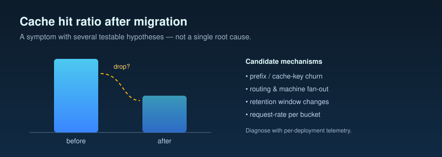

# When Cache Hit Ratio Drops After Reasoning-Model Migration



> **Read this before you change a deployment knob.** This document
> enumerates the *testable hypotheses* for the symptom *"our cache
> hit ratio dropped after we migrated to a reasoning model."* It does
> not promise any of them is the root cause in your deployment — root
> cause requires per-deployment telemetry the repo does not have. For
> each hypothesis it gives (a) the mechanism, (b) the architectures
> where it tends to apply, (c) status against in-repo measurement,
> and (d) a concrete diagnostic recipe. Scope: this repo measures on
> **PAYG capacity**; PTU-specific phenomena are surfaced as
> hypotheses, not verdicts (Task 011 Principle 6; methodology §6 /
> §9).

In this document, pay-as-you-go (PAYG) capacity is shared and billed per token;
provisioned throughput is a deployment type with dedicated fixed capacity,
measured in provisioned throughput units (PTUs); quota is a policy limit, not
guaranteed capacity.

## 1. The observation

Some teams report that after migrating from `gpt-4o` to a
reasoning-class model such as `gpt-5.2`, prompt cache hit ratio
drops measurably — sometimes several percentage points — even when
"nothing else changed."

The symptom is real; the mechanism is **not single-cause**. Strong-
form "reactive PTU spillover thrashes the cache" was weakened by
customer field evidence (PTU-only operation also maintained cache
hit; see Hypothesis G). Here, spillover means automatic routing of
overflow requests from a saturated provisioned deployment to a
standard deployment. This document carves the space into
mutually-distinguishable hypotheses, marks the ones the repo has
direct evidence on, and lists per-call telemetry to triage your own
deployment. Reading guides: **by architecture**, multi-node
orchestration triggers A / E first; single-call reasoning-and-acting
agent loop (ReAct) on PTU+spillover surfaces G + H first (§11); PTU reasoning-model
migrations that inflated `max_output_tokens` for reasoning headroom
add I as a high-priority concurrency perspective. Methodology baseline for
`cached_tokens`: [`docs/05-methodology.md` §4](05-methodology.md) —
captured (never inferred) from
`usage.prompt_tokens_details.cached_tokens` on every call.

## 2. Hypothesis A: System prompt restructuring

*Architecture applicability:* multi-node orchestration; relevant to
single-call ReAct only when the prompt was simultaneously revised as
part of the migration.

*Status:* well-understood mechanism, testable via system-prompt-hash
logging; no in-repo measurement is needed because cache invalidation
is a methodology invariant ([§2 controlled variables](05-methodology.md)):
even a single character change in the system prompt flushes the
cache.

If the migration touched the system prompt for any reason (added a
preamble, restructured a tool description, changed bullet formatting,
inserted a date), the cacheable prefix changes byte-wise and prior
cache state becomes unreachable. Cache hit ratio drops to zero on
the first request under the new prompt and rises again as that
prompt accumulates hits.

### How to test this hypothesis

1. Capture the SHA-256 of the system prompt sent on each call (the
   Phase 1 / Phase 2 simulators do this via
   `cell_metadata.system_prompt_sha256`; see
   [`benchmarks/05-dual-spillover/README.md`](../benchmarks/05-dual-spillover/README.md)
   "Per-request capture schema").
2. Segment cache hit ratio by `system_prompt_sha256`.
3. If the drop coincides with a new hash appearing in the stream, A
   is the mechanism. If multiple hashes existed before the migration
   and the drop is uniform across all of them, A is unlikely.

## 3. Hypothesis B: Reasoning models cache differently

*Architecture applicability:* any architecture, any consumption model.

*Status:* mechanism plausible, not directly measured in this repo.
The cost contract has changed (reasoning models add
`output_tokens_details.reasoning_tokens` billed at the output rate
per [methodology §6.1](05-methodology.md)) but whether the *cache*
layer behaves identically across model families is a question the
repo does not currently exercise. The `cached_tokens` field is
captured the same way on both families (methodology §4 rule 1).

### How to test this hypothesis

1. Stand up two deployments — one `gpt-4o`, one `gpt-5.2` — and route
   a byte-identical workload to both, holding all other variables
   constant.
2. Compare per-request `cached_tokens` distributions, segmented by
   request index so cold-prefix and warm-prefix windows are
   comparable.
3. A persistent gap that does not close as both deployments warm up
   is evidence for B.

## 4. Hypothesis C: Cache time-to-live (TTL) differences

*Architecture applicability:* any; particularly visible on bursty
workloads where idle gaps exceed the cache TTL.

*Status:* mechanism named in Azure documentation; the repo captures
`prompt_cache_retention` (see
[`benchmarks/05-dual-spillover/README.md`](../benchmarks/05-dual-spillover/README.md))
but has not varied it across runs to compare in-memory (default) vs
extended retention. The repo therefore tells you *nothing* about how
much of an observed drop is attributable to TTL.

**Retention truth-table.** Treat the table below as a *deployment-
config check you run on your own resource* — the rows are confirmed
by capturing `prompt_cache_retention` per request (Phase 2 schema);
the magnitude of any post-idle dip is workload-specific and not
directly measured in this repo:

| `prompt_cache_retention` | Default? | TTL behavior | How to verify |
|---|---|---|---|
| `in_memory` | Yes — unless overridden | Aggressive eviction; per-deployment process-memory window | Log the value the client actually sends per request |
| `24h` (extended) | No — opt-in on supported model versions | ~24 h | Deployment config + per-request capture |

### How to test this hypothesis

1. Run two otherwise identical bursty workloads with different
   `prompt_cache_retention` values.
2. Compare the post-idle first-burst `cached_tokens` between the two.
3. If the extended-retention run shows materially higher warm-cache
   hit rate after each idle gap, C is the mechanism.

## 5. Hypothesis D: Request pattern change

*Architecture applicability:* multi-node → single-call ReAct
migrations (the queries-per-second (QPS) profile changes), or vice versa.

*Status:* mechanism named; the repo does not directly measure the
QPS-versus-cache-hit relationship. The Phase 1 simulator
([`benchmarks/04-spillover-simulation/README.md`](../benchmarks/04-spillover-simulation/README.md))
chose a single-call ReAct profile with a long stable system prompt
because that is the task profile this hypothesis family is about. Migrating
from N parallel small calls to one large call changes both per-key
QPS into the cache and the prefix lifetime distribution; hit ratio
is a joint function of both.

### How to test this hypothesis

1. Log `request_idx`, `wallclock_timestamp_iso`, and `cached_tokens`
   per call.
2. Bucket by minute and compute mean cached_tokens-per-input.
3. If the post-migration QPS profile is structurally different (e.g.
   fewer requests per session with longer gaps), D becomes a
   plausible contributor independent of any other mechanism.

## 6. Hypothesis E: Prefix variance from tool-use changes

*Architecture applicability:* tool-using agents; especially when the
tool surface, JSON schema, or tool-description ordering changed
during migration.

*Status:* mechanism well-supported by benchmark 03 evidence. The
tool-loop input tokens dominate cost for each benchmark cell (one
model-and-effort setting) because the system
prompt + tool definitions get re-sent on every iteration
([`benchmarks/03-tool-using-agent/analysis.md` §5](../benchmarks/03-tool-using-agent/analysis.md)).
Anything that mutates the tool-definition block invalidates the
cacheable prefix the way A invalidates it for the system prompt.

### How to test this hypothesis

1. Capture `sha256(system_prompt || tool_definitions_json || schema_json)`
   per call. Segment cache hit ratio by that hash — if a new hash
   took over coincident with the drop, E is the mechanism (same
   playbook as A, wider "prefix" definition).

## 7. Hypothesis F: PTU routing / spillover specifics

*Architecture applicability:* PTU deployments with native spillover
configured (`spilloverDeploymentName` attribute), or with a custom
router sending the same logical request to multiple deployments.

*Status:* the repo's Phase 2
([`benchmarks/05-dual-spillover/README.md`](../benchmarks/05-dual-spillover/README.md))
used a **custom Python-side router**, not Azure-native spillover.
The Phase 2 runner captures native-spillover diagnostic headers
(`x-ms-spillover-from-deployment`, `x-ms-deployment-name`,
`x-ms-spillover-error`) per request, so any deployment using native
spillover can confirm Azure-side re-routes and where the bill landed.
Azure caches per deployment name: any request landing on a different
deployment (native or custom) hits a different cache pool by design
and per-pool warm-up takes time.

### How to test this hypothesis

1. Log `x-ms-deployment-name` and `x-ms-spillover-from-deployment`
   per call.
2. Segment cache hit ratio by `x-ms-deployment-name`. If the
   post-migration drop concentrates in requests where it differs from
   the primary, F is the mechanism. Phase 2 itself (custom router)
   shows the same per-deployment cache-pool separation native
   spillover would show.

## 8. Hypothesis G: Reactive spillover causes PTU cache thrashing

*Architecture applicability:* single-call ReAct deployments on
PTU-with-spillover (native or custom).

*Status:* **strong form rejected; weak form measured (mitigation
question, not root-cause question).** Strong-form (spillover *is*
the root cause of the migration-era drop) was weakened by customer
field measurement before the in-repo simulators ran: PTU-only
deployments also maintained cache hit
([`benchmarks/04-spillover-simulation/analysis.md` §1, §11](../benchmarks/04-spillover-simulation/analysis.md)),
so spillover routing cannot be the sole root cause. Weak-form (under
sustained near-saturation the cache can dip and recover; proactive
policy *may* smooth this better than reactive) is what Phase 1 and
Phase 2 measure.

### What this repo measured

**Phase 1 — single-endpoint simulator, shared cache pool**
([`benchmarks/04-spillover-simulation/analysis.md`](../benchmarks/04-spillover-simulation/analysis.md)):

In the tables below, time-to-first-token (TTFT) is reported as p50
(median/50th-percentile) and 95th-percentile latency (p95).

| Metric | Reactive | Proactive | Source |
|---|---:|---:|---|
| Sustain cache hit ratio | 99.2337 % | 99.0680 % | analysis.md §5, §7 |
| Sustain proactive − reactive gap | — | −0.1657 pp | analysis.md §5 |
| Full-run PAYG total | $17.883347 | $17.924671 | analysis.md §3, §8 |
| Sustain TTFT p50 / p95 (ms) | 8,490.6 / 13,617.5 | 7,620.9 / 12,107.8 | analysis.md §7 |
| Real 429s observed | 0 | 0 | analysis.md §7 |

Phase 1 headline: proactive did **not** beat reactive on sustain
cache hit ratio. The gap is descriptive only and bounded by the
shared-cache property of Phase 1's design.

**Phase 2 — two real deployments, separate cache pools, real 429s**
(committed under
[`benchmarks/05-dual-spillover/runs/`](../benchmarks/05-dual-spillover/runs/);
the formal analysis.md follow-up is pending, so Phase 2 numbers below
come from the `.summary.json` files and the `CHANGELOG.md` Task 015
entry):

| Metric | Reactive | Proactive | Source |
|---|---:|---:|---|
| Scheduled / completed requests | 2,136 / 2,136 | 2,136 / 2,303 (incl. primary HTTP rate-limit 429 follow-ups) | `*.summary.json` |
| Overall cache hit ratio | 99.05 % | 98.21 % | `*.summary.json` |
| Primary-endpoint cache hit ratio | 95.11 % (24 reqs) | 97.75 % (1,305 reqs) | `*.summary.json` |
| Spillover-endpoint cache hit ratio | 99.09 % (2,112 reqs) | 98.74 % (998 reqs) | `*.summary.json` |
| Spillover request fraction | 98.88 % | 43.33 % | `*.summary.json` |
| Primary real 429 count | 0 | 167 | `*.summary.json` |
| Spillover real 429 count | 0 | 0 | `*.summary.json` |
| Total PAYG spend | $17.8957 | $18.8060 | `*.summary.json` |

Pricing: `pricing/azure-openai-payg-2026-05.yaml` (accessed 2026-05-19) for both runs.

Phase 2's contribution over Phase 1 is **cache-pool separation**
(different deployment name → different Azure cache pool). Reactive
routed nearly all traffic to the high tokens-per-minute (TPM) spillover deployment
(98.88 %), which warmed quickly and held 99.09 % per-endpoint cache
hit; the primary stayed cold (95.11 % over 24 requests). Proactive
ramped spillover only as p95 latency drifted (43.33 % share); its
primary saw 167 real 429s vs. 0 for reactive, overall cache hit
dropped to 98.21 %, and PAYG spend ran $0.91 higher.

Read together, Phase 1 and Phase 2 agree on weak-form G: **policy
choice between reactive and proactive did not create a clean
sustained cache-hit advantage in either substrate**. Phase 2 does
**not** speak to native Azure-side spillover (diagnostic headers
captured for Task 021 follow-up, not analyzed here), PTU billing,
or any specific customer deployment.

### How to test this hypothesis

1. Log `cached_tokens`, `deployment_used`, `real_429_observed`, and
   `retry_after_ms` per call. The Phase 2 schema is reusable as-is
   ([`benchmarks/05-dual-spillover/README.md`](../benchmarks/05-dual-spillover/README.md)
   "Per-request capture schema").
2. Compute per-endpoint cache hit ratio over time. A re-routed
   request landing on a cold spillover pool will have
   `cached_tokens == 0` even when the prefix is byte-identical to the
   primary-pool warm prefix — that is the cache-pool-separation tell.
3. If the symptom is *transient dips that recover as load drops*,
   weak-form G applies and the leverage is policy timing. If the
   symptom is a *persistent* drop with stable load, look at A / E
   first.

## 9. Hypothesis H: Single-call ReAct planning variance reduces prefix stability

*Architecture applicability:* single-call ReAct architectures (one
large call per turn that internally plans, retrieves, and
synthesizes), particularly when the planning surface is
non-deterministic.

*Status:* mechanism named; **not directly measured in this repo at
write time** (planned re-analysis under
`benchmarks/{01,02}-*/HYPOTHESIS_H_REANALYSIS.md` has not landed).
Recipe stands; magnitude does not.

Mechanism: single-call ReAct migrations typically pull several
input-side knobs at once — tool definitions inlined, structured-
output schemas added, retrieval results inserted into the prompt
rather than a separate retrieval call, sometimes reasoning effort
bumped. Each change either adds new bytes to the cacheable prefix or
injects per-request variance into the previously-stable part. The
result resembles A and E combined: a post-migration cache hit drop
that survives even when "the system prompt is the same."

### How to test this hypothesis

1. Pin the system prompt and tool-definition block byte-identical
   between the multi-node and single-call ReAct architectures
   (methodology §2).
2. Vary only the orchestration profile, holding everything else
   constant.
3. Compare per-call `cached_tokens`. A persistent gap that does not
   close under matched prefixes is evidence the orchestration profile
   itself is reducing prefix stability.
4. If cached-prefix length varies per call (retrieved passages
   inlined into the system message), move variable content out of
   the cacheable prefix — keep retrieval results in a separate user
   message.

## 10. Hypothesis I: `max_output_tokens` as a PTU admission-time reservation

*Architecture applicability:* PTU deployments serving reasoning
models where `max_output_tokens` (or `max_tokens`) was inflated to
leave headroom for invisible
`output_tokens_details.reasoning_tokens`. Independent of routing
topology.

*Status:* **mechanism named in the Azure PTU concept documentation;
not directly measured in this repo at write time.** Task 019 owns
the controlled `max_output_tokens` sweep — not yet landed under
`benchmarks/`. This section frames the testable hypothesis so the
operational tightening rule in
[`docs/08-customer-simulation-findings.md`](08-customer-simulation-findings.md)
L5 can already cite the mechanism. [`README.md`](../README.md) lists
I as one of the highest-priority perspectives for PTU reasoning-model
migration debugging.

Mechanism: per the Azure PTU concept documentation, the admission
controller evaluates each request's projected utilization at
*admission time* from the `max_output_tokens` the client sends — not
from the actual output size. Reasoning-model migrations commonly
inflate `max_output_tokens` (e.g. ~4 K visible target bumped to ~16 K)
to leave room for `reasoning_tokens` consumed invisibly. Even when
actual visible output is unchanged, the larger reservation reduces
effective PTU concurrency: at the same arrival rate, 429s arrive at
lower requests per minute (RPM) and TTFT under load rises. Bill per
completed request and
visible output bytes do not change; the lever is the asymmetry
between *reserved* and *spent* tokens.

### How to test this hypothesis

1. Hold workload byte-identical across cells: long stable system
   prompt, user-prompt subset whose expected visible output is short
   (≤ 200 tokens), `reasoning.effort` fixed at the lowest accepted
   level for the model, same slow-ramp arrival schedule.
2. Sweep `max_output_tokens` over a log2 ladder
   (`[256, 512, 1024, 2048, 4096, 8192, 16384]`) per cell. Use one
   throttled PTU deployment with spillover disabled so 429s surface
   as cell-level failures, not as routed-away traffic.
3. Per cell record 429-onset RPM (rolling 60 s arrival rate at first
   429), sustained-429 rate, p50/p95 TTFT in the sustained-but-below-
   onset window, mean visible output tokens
   (`usage.output_tokens − reasoning_tokens`), mean reasoning tokens.
4. Monotone-decreasing 429-onset RPM as `max_output_tokens` grows —
   with visible output flat across cells — is direct evidence for I.
   A flat or non-monotone curve weakens the hypothesis.

Until Task 019 lands, doc-08 L5 frames the tightening rule from
mechanism plus methodology §2 invariants — not an in-repo magnitude.

## 11. How to diagnose in your own deployment

### 11.1 Per-call telemetry baseline

Capture this minimum field set on **every** production call (per
Phase 1 / Phase 2 schemas or methodology §7):

- `usage.prompt_tokens_details.cached_tokens` (methodology §4 rule 1)
- `usage.input_tokens`, `usage.output_tokens`,
  `usage.output_tokens_details.reasoning_tokens` (methodology §6)
- `sha256(system_prompt)` and
  `sha256(system_prompt || tool_definitions_json || schema_json)`
  — segment cache hit ratio by both (catches A and E)
- `deployment_used`; `x-ms-deployment-name`,
  `x-ms-spillover-from-deployment`, `x-ms-spillover-error`
- `real_429_observed`, `retry_after_ms`, `retry_count`
- `wallclock_timestamp_iso` (per-minute aggregates)
- `prompt_cache_retention` (extended-retention switch shows up as a step change)
- `max_output_tokens_sent` (PTU admission-reservation perspective — Hypothesis I)

A `cached_tokens` drop without a coincident change in any
segmentation key above is a flag, not a footnote (methodology §4
rule 4).

### 11.2 Per-architecture flowchart

```
START — symptom: "cache hit ratio dropped after migration"

├── Multi-node orchestration?
│     ├── Yes + prompt/tool-def revision → start A and E; escalate C/D.
│     └── Yes, no revision               → start D and B; escalate C
│                                          on bursty workloads.
├── Single-call ReAct on PAYG?
│     → start H and B; escalate E (tool definitions inside prompt).
└── Single-call ReAct on PTU + spillover?
      ├── Default: G (weak) AND H. In-repo evidence speaks to G; H is
      │   recipe-only. **Add I if `max_output_tokens` was inflated.**
      ├── Azure-native spillover → add F; segment by `x-ms-deployment-name`.
      └── Proactive already in place + still seeing symptom → G less
          likely; check H, C, and I next.
```

### 11.3 What the in-repo runs tell you and what they don't

The repo has direct evidence for **weak-form G only** (Phase 1 +
Phase 2). Every other hypothesis gets a methodology citation, a
per-call schema, and a recipe — not a magnitude. Magnitudes require a
controlled A/B in your own deployment. PTU-specific phenomena (slot
routing, capacity-correlated cache effects, real PTU billing) remain
hypotheses, not verdicts — the repo measures on PAYG (methodology §6;
Task 011 Principle 6).

## 12. Cross-references

- [`docs/05-methodology.md`](05-methodology.md) — measurement
  contract (§2 invariants, §4 cache, §6 cost formula, §9 limits).
- [`docs/04-decision-framework.md`](04-decision-framework.md) — which
  `reasoning_effort` for which task profile.
- [`docs/08-customer-simulation-findings.md`](08-customer-simulation-findings.md)
  — narrative payoff for a PTU + single-call ReAct customer.
- [`benchmarks/04-spillover-simulation/analysis.md`](../benchmarks/04-spillover-simulation/analysis.md)
  — Phase 1, weak-form G, single-endpoint shared-cache simulator.
- [`benchmarks/05-dual-spillover/README.md`](../benchmarks/05-dual-spillover/README.md)
  + `runs/*.summary.json` — Phase 2; numbers in §8 from `.summary.json`
  + `CHANGELOG.md` Task 015 entry. Formal analysis.md follow-up pending.
- [`pricing/azure-openai-payg-2026-05.yaml`](../pricing/azure-openai-payg-2026-05.yaml)
  — per-token rate snapshot (accessed 2026-05-19).
