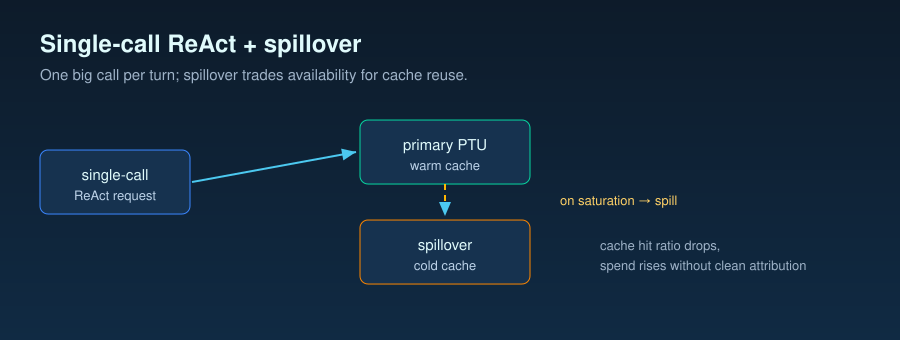

# Customer-Scenario Findings: Provisioned Throughput Unit (PTU) + Single-Call Reasoning-and-Acting Agent Loop (ReAct) Cache & Spend

> **Forwardable to your dev team without translation.** End-to-end
> story — symptom, mechanisms the in-repo measurements speak to, what
> you can change today — for the single-call-ReAct-on-PTU-with-
> spillover deployment pattern. No customer is named; no
> deployment-specific numbers are quoted; every magnitude resolves to
> a `benchmarks/*/analysis.md` or a methodology citation.

## 1. Who this is for

You are an engineer or architect on a deployment that:

- Migrated from `gpt-4o` (often multi-node — retrieval, planning,
  generation as separate calls) to `gpt-5.2` (one large single-call
  ReAct call per turn that internally plans, retrieves, answers).
- Runs on Azure OpenAI **PTU** with spillover configured: automatic
  routing of overflow requests from a saturated provisioned deployment
  to a standard deployment (Azure-native `spilloverDeploymentName` or
  a custom client-side router).
- Observed, after migration, that **prompt cache hit ratio dropped**
  and/or **PTU spend rose** without clean attribution.

This is not a customer story. It is the pattern multiple PTU +
reasoning-model deployments tend to exhibit; the leverages below are
those the in-repo measurement evidence supports.

## 2. The pattern in three sentences

1. **Symptom.** Cache hit ratio drops a measurable amount and PTU
   spend rises after multi-node → single-call ReAct migration, often
   with the system prompt visibly unchanged.
2. **Suspected mechanisms.** Rarely single-cause; the in-repo
   simulations weakened the strong "spillover thrashes the cache"
   story and surfaced a smaller mitigation question (Phase 1 /
   Phase 2). Remaining mechanism families matching this architecture
   are enumerated in
   [`docs/07-cache-hit-degradation.md`](07-cache-hit-degradation.md)
   §11's per-architecture flowchart.
3. **Available leverages.** Four levers below have evidence-cited
   mechanisms in this repo (L1–L4); a fifth (L5) is a *tightening
   rule* derived from Hypothesis I (doc-07 §10) plus methodology §2
   invariants — direct measurement is pending (Task 019).

## 3. What this repo measured (and what it did not)

### Measured

- **Phase 1 — single-endpoint spillover-policy simulator.**
  One live Azure `gpt-5.2` deployment, internally-simulated throttle
  state, shared cache pool between "primary" and "spillover" route
  labels
  ([`benchmarks/04-spillover-simulation/analysis.md`](../benchmarks/04-spillover-simulation/analysis.md);
  effort = low, long stable system prompt).
- **Phase 2 — two real deployments, real HTTP rate-limit 429s, separate cache pools.**
  Low tokens per minute (TPM) on the throttled primary plus high-TPM
  spillover in one Microsoft Foundry
  resource
  ([`benchmarks/05-dual-spillover/README.md`](../benchmarks/05-dual-spillover/README.md)
  + committed `runs/*.summary.json`; formal analysis.md is a follow-
  up, so Phase 2 numbers here quote `.summary.json` and the
  `CHANGELOG.md` Task 015 entry).
- **Benchmarks 01 / 02 / 03 effort sweeps.** Per-effort cost,
  throughput, quality for short-factual, multi-step reasoning, tool-
  using task profiles ([`results/summary.md`](../results/summary.md);
  [`docs/04-decision-framework.md`](04-decision-framework.md)).

### Not measured

- Your actual deployment, prompt, workload mix, routing topology.
- **PTU billing under load.** Simulator runs on pay-as-you-go (PAYG); PTU mentions
  are token-pressure proxies, not billed PTU numbers.
- **Native Azure-side spillover mechanics**
  (`spilloverDeploymentName` routing internals, slot allocation).
  Phase 2 uses a custom router; native-spillover headers captured for
  Task 021 but not analyzed.
- **Region-specific behavior** (methodology §9).
- **Hypothesis H input-side re-analysis on benchmarks 01 / 02.**
  `HYPOTHESIS_H_REANALYSIS.md` not landed; H is recipe in doc-07 §9,
  not magnitude.
- **Hypothesis I `max_output_tokens` admission-time reservation.**
  Direct measurement is Task 019's owner; doc-07 §10 frames the
  testable hypothesis and L5 below gives the tightening rule from
  mechanism + invariants.

## 4. Findings summary table

| Evidence source | Hypothesis tested | Headline finding | Applicability caveat |
|---|---|---|---|
| **Phase 1** ([analysis.md](../benchmarks/04-spillover-simulation/analysis.md)) — single-endpoint simulator, shared cache pool, 2,136 requests per policy | G (weak form): does proactive spillover beat reactive on sustain-phase cache hit ratio? | Sustain cache hit ratio: reactive **99.2337 %**, proactive **99.0680 %** (proactive − reactive gap **−0.1657 pp**, §5/§7). Proactive **did not** beat reactive. Full-run PAYG: reactive $17.883347, proactive $17.924671 (§3, §8). | Single endpoint → primary and spillover share one Azure cache pool by design; absolute magnitudes do not transfer to deployments with truly separate cache pools (§10). |
| **Phase 2** (`runs/*.summary.json` + CHANGELOG Task 015 entry) — two real deployments, separate cache pools, real 429s, 2,136 scheduled requests per policy | G (weak form) with cache-pool separation: does proactive policy avoid the cold-pool warm-up cost reactive's nearly-all-traffic-to-spillover behavior imposed? | Overall cache hit ratio: reactive **99.05 %**, proactive **98.21 %** (`.summary.json` `cache_hit_ratio_overall`). Primary real 429s: reactive **0**, proactive **167** (`primary_real_429_count`). Spillover request fraction: reactive **98.88 %**, proactive **43.33 %**. PAYG: reactive **$17.8957**, proactive **$18.8060**. | Custom Python-side router, not native Azure spillover; results do not adjudicate `spilloverDeploymentName` behavior. Two deployments in one Foundry resource; one capacity tier each. |
| **H re-analysis** (planned `benchmarks/{01,02}-*/HYPOTHESIS_H_REANALYSIS.md`) | H′: single-call ReAct migration shifts input-side prefix profile independent of system-prompt edits | **Pending — not in the repo at write time.** Mechanism named in [`docs/07-cache-hit-degradation.md`](07-cache-hit-degradation.md) §9; no magnitude claim from this repo. | The diagnostic recipe (pin prompt + tool defs, vary only orchestration profile) is reusable; the measurement is not yet committed. |

Read together, the two phases agree: **the mitigation for weak-form G
is not "flip reactive to proactive blindly."** Phase 1 (shared cache):
proactive lost sustain hit by −0.17 pp; Phase 2 (separate pools):
reactive avoided real 429s by warming spillover early while proactive
incurred 167 primary 429s at the same scheduled load. Neither phase
gives a clean proactive win.

## 5. The five leverages

Each leverage names: (a) **mechanism** (Hypothesis letter from
[`docs/07`](07-cache-hit-degradation.md)), (b) **in-repo evidence**,
(c) **two-perspective translation** (PAYG dollar impact / PTU throughput-
gain framing).

### L1. First-token timeout tuning (mechanism G, Phase 1 / Phase 2)

**What.** Reactive policy routes a request to spillover when first-
token latency exceeds `first_token_timeout_ms` (default 3000;
[`benchmarks/04-spillover-simulation/README.md`](../benchmarks/04-spillover-simulation/README.md)).
Shorter timeout shrinks "throttled-but-not-yet-spilled" duration.

**In-repo evidence.** Phase 1 sustain first-token p50 (median/50th-percentile) / 95th-percentile latency (p95): 8,490.6 /
13,617.5 ms (reactive), 7,620.9 / 12,107.8 ms (proactive)
([analysis.md §7](../benchmarks/04-spillover-simulation/analysis.md));
Phase 2 across two deployments: 7,383.3 / 11,967.2 ms (reactive),
10,239.9 / 34,631.7 ms (proactive) (`runs/*.summary.json`).

**Translation.**
- **PAYG.** Re-routed requests bill at the same per-token rates
  (`gpt-5.2` $1.75 / $0.175 / $14.00 per 1M input / cached / output);
  tightening is latency-driven, keeping cached-input rate dominant.
- **PTU.** Cannot reduce a PTU bill. Phase 1 proactive-vs-reactive
  throughput proxy ≈ 1.000 × — flat
  ([§8](../benchmarks/04-spillover-simulation/analysis.md)); do not
  budget large PTU gains here.

### L2. Proactive vs reactive spillover policy choice (mechanism G, Phase 1 / Phase 2)

**What.** Proactive watches rolling p95 latency and ramps spillover
before the primary throttles
([`benchmarks/04-spillover-simulation/README.md`](../benchmarks/04-spillover-simulation/README.md));
reactive waits for timeout / 429 trigger.

**In-repo evidence.** Phase 1 sustain cache hit gap **−0.1657 pp**
(proactive − reactive); proactive lost
([analysis.md §5, §11](../benchmarks/04-spillover-simulation/analysis.md)).
Phase 2 (separate pools): proactive **167 real primary 429s** vs
reactive **0** (spillover share 98.88 % vs 43.33 %;
`runs/*.summary.json`); overall cache hit 99.05 % reactive vs 98.21 %
proactive.

**Translation.**
- **PAYG.** Both phases policy spend within $1 over ~2,100 requests
  ($17.88 vs $17.92; $17.90 vs $18.81); proactive-is-cheaper does
  **not** hold — tune timeout (L1) and prefix stability (L3) first.
- **PTU.** Phase 1 throughput proxy ≈ 1.000 ×
  ([§8](../benchmarks/04-spillover-simulation/analysis.md)); Phase 2:
  proactive's primary 429 count is the operational signal first.

### L3. System prompt stability (mechanism A; methodology invariant)

**What.** Any byte change in the system prompt invalidates the cache
and starts cache hit ratio at zero until the new prompt accumulates
hits — methodology §2 invariant.

**In-repo evidence.** Invariant; Phase 1 / Phase 2 schemas
(`cell_metadata.system_prompt_sha256`) are the operational tooling
to monitor this in production.

**Translation.**
- **PAYG.** A cache miss on a long system prompt bills full input
  ($1.75 / 1M) vs cached-input ($0.175 / 1M) — 10× per-token cost on
  the prefix portion of every affected request. Rule: no "small"
  prompt edit ships without a warmed-cache re-baseline.
- **PTU.** Throughput-protects by keeping the cacheable prefix
  stable. Phase 1's large-prefix workload sustained 99 %+ cache hit;
  a single edit dropping it to 0 % until re-warm scales primary
  input pressure ~10× per affected call.

### L4. Reasoning effort tuning (mechanism: cost composition, benchmarks 01 / 02 / 03)

**What.** `reasoning_effort` is per-request. Reasoning tokens bill at
the output rate and are invisible (methodology §6); higher tiers spend
more reasoning tokens without necessarily lifting quality.

**In-repo evidence.** Null-case
([`benchmarks/01-short-factual/analysis.md` §5, §10](../benchmarks/01-short-factual/analysis.md)):
`effort = none` at $0.000587 ± $0.000124 / req vs gpt-4o
$0.000665 ± $0.000089 (12 % PAYG saving) at a marginally higher judge
score (1.95 vs 1.90); no tier above `none` lifted quality, and with
reasoning tokens ≈ 0 the bill stayed flat across the ladder. Multi-step
([`02-multi-step-reasoning/analysis.md`](../benchmarks/02-multi-step-reasoning/analysis.md)
via [`results/summary.md` §3](../results/summary.md)): `effort = none`
$0.000618 / correct vs gpt-4o $0.001064 (42 % PAYG saving). Tool-using
([`03-tool-using-agent/analysis.md` §5, §6, §7](../benchmarks/03-tool-using-agent/analysis.md)):
`gpt-5.2 low` Pareto-optimal default.

**Translation.**
- **PAYG.** More reasoning tokens = higher bill. On the ceiling / mixed
  cases the cost-per-correct is lowest at the lowest non-zero effort
  (`none` / `low`); on the null case reasoning tokens are ≈ 0, so the
  bill is flat across the ladder and is lowest at `none`. Never default
  `high` or `xhigh` ([`results/summary.md` §3, §5](../results/summary.md)).
- **PTU.** Throughput-gain factor vs gpt-4o on benchmark 01:
  `none = 0.989 ×`, `low = 0.989 ×`, `medium = 0.988 ×`,
  `high = 0.983 ×`, `xhigh = 0.986 ×`
  ([benchmark 01 §6](../benchmarks/01-short-factual/analysis.md)) —
  a ~1 % wash; fold in the higher null-case pass-rate and `gpt-5.2 none`
  nets +4.4 % correct-answers-per-minute. Ceiling case
  (benchmark 02): `gpt-5.2 none` wins on both perspectives
  ([results/summary.md §3](../results/summary.md)). See
  [`docs/04-decision-framework.md`](04-decision-framework.md).

### L5. `max_output_tokens` tightening on PTU (mechanism: Hypothesis I — operational rule, direct measurement pending)

**What.** Hypothesis I
([`docs/07-cache-hit-degradation.md` §10](07-cache-hit-degradation.md);
[`README.md`](../README.md)) frames `max_output_tokens` as a PTU
*admission-time reservation*, not a soft cap. Inflating it for
reasoning headroom silently reduces effective concurrency: at the
same arrival rate, 429s surface at lower requests per minute (RPM)
and time-to-first-token (TTFT) under load
rises while the bill per completed request is unchanged. The lever
is *tightening*, not removing.

**In-repo evidence.** Phase 1 explicitly states "The run does not
exercise Hypothesis I"
([`benchmarks/04-spillover-simulation/analysis.md` §10](../benchmarks/04-spillover-simulation/analysis.md));
Phase 2 does not measure it either. Task 019 owns the controlled
sweep over `[256, 512, 1024, 2048, 4096, 8192, 16384]` on a throttled
PTU deployment with spillover disabled (doc-07 §10 "How to test");
the `benchmarks/` artifact has not landed at write time. Mechanism
citation is methodology-grade: the Azure PTU concept docs price
admission on the *reservation*, not the spend.

**Tightening rule (apply now, re-measure after).**

1. From a representative production sample, compute p99 (99th-percentile) of visible
   output (`usage.output_tokens − reasoning_tokens`) and p99 of
   `reasoning_tokens` per call class (tool-loop vs answer-synthesis
   p99s typically differ).
2. Set `max_output_tokens = ceil((p99_visible + p99_reasoning) × 1.15)`
   per call class.
3. Re-measure 429-onset RPM on the throttled primary at the new value
   vs the inflated baseline. Higher 429-onset RPM at unchanged
   visible output is direct local confirmation of I.
4. Treat any single request legitimately needing more reservation as
   a per-call override, not a global cap raise.

**Translation.** **PAYG:** reservation does not change a PAYG bill
(PAYG bills observed tokens); adopt L5 only on or before PTU
migration. **PTU:** tightening raises effective concurrency at fixed
PTU capacity; magnitude is deployment-specific (Task 019 supplies
direction-of-effect reference, not a transferable factor).

## 6. What you cannot fix with this evidence

- **System prompt content.** L3 says *don't change the bytes*; it
  does not say *what the bytes should be*. Content is gated by your
  safety and quality teams; cache only cares the bytes are stable.
- **ReAct planning variance** (Hypothesis H′). Magnitude is
  unmeasured (`HYPOTHESIS_H_REANALYSIS.md` not landed). Mitigation
  if the recipe in
  [`docs/07-cache-hit-degradation.md`](07-cache-hit-degradation.md)
  §9 confirms H′: move variable content out of the cacheable prefix
  (retrieval results to a user message, not the system one).
- **PTU sizing / billing.** Throughput-gain numbers are token-
  pressure proxies, not billed PTU magnitudes (methodology §6, §9;
  Task 011 Principle 6).
- **Native Azure spillover internals.** Phase 2 uses a custom
  router; diagnostic headers captured but not analyzed (Task 021
  owner).

## 7. Quick diagnostic recipe

Five operational steps, in order:

1. **Log per call: `cached_tokens`, `input_tokens`, `output_tokens`,
   `reasoning_tokens`, `deployment_used`, `x-ms-deployment-name`,
   `x-ms-spillover-from-deployment`, `x-ms-spillover-error`,
   `real_429_observed`, `retry_after_ms`, `prompt_cache_retention`,
   `max_output_tokens_sent`, `prompt_cache_key`,
   `wallclock_timestamp_iso`.** Phase 2 per-request schema verbatim
   (`benchmarks/05-dual-spillover/README.md`); minimum surface to
   triage *any* of the nine hypotheses in doc-07.
2. **Hash and segment.** Compute `sha256(system_prompt)` and
   `sha256(system_prompt || tool_definitions_json || schema_json)`
   per call. Plot cache hit ratio by both. A drop coinciding with a
   new hash is A or E (doc-07 §2 / §6); a drop that does *not*
   segregate by hash is one of the other seven.
3. **Segment by deployment.** Plot cache hit ratio by
   `x-ms-deployment-name`. A persistent gap confirms cache-pool
   separation (F / G; doc-07 §7 / §8). Phase 2 `.summary.json`:
   primary 95.1 % (reactive) / 97.8 % (proactive) vs spillover
   99.1 % / 98.7 %.
4. **Watch `retry_after_ms`.** Treat the header as the observed
   backoff signal captured by Phase 2; this repo does not infer a
   deterministic reset. Capture, plot, feed into the router's
   backoff (Phase 2 captures both `retry_after_ms` and
   `retry_after_seconds`).
5. **Monitor first-token p95.** Sustained p95 rise is the early
   warning for a proactive policy; Phase 1 / Phase 2 p50 / p95 are
   calibration reference, not a transfer target.

If step 2 *does* segregate by a known hash change, stop — the fix is
to roll back or warm the new prefix deliberately. If it does not,
steps 3 + 4 + 5 jointly narrow to G / H / F / I.

### 7.1 Retention truth-table (deployment-config check)

`prompt_cache_retention` is a per-request switch with two practical
values (`in_memory` default vs `24h` extended opt-in); see
[`docs/07-cache-hit-degradation.md` §4](07-cache-hit-degradation.md)
for the table. Verification: log the value the client sends per
request and confirm the deployment exposes the extended-retention SKU
on supported model versions. Magnitudes of any post-idle dip are
workload-specific and not directly measured in this repo.

### 7.2 `prompt_cache_key` and ~15 req/min overflow / bucketing taxonomy

Azure groups cache entries by `prompt_cache_key`; per published
guidance an individual bucket sustains approximately **15 req/min**
before further callers re-route to shared backing capacity (cold
prefix likely). Bucketing trades cache reuse against overflow risk.

| Bucketing choice | Per-bucket RPM | Behavior |
|---|---|---|
| One bucket (no key set) | All RPM on one key | Overflow above ~15 req/min |
| Per-tenant or per-profile | RPM ÷ buckets | Warm bucket; overflow only above threshold |
| Per-request unique | 1 RPM | Always cold; defeats the cache |

Rule of thumb: `recommended_buckets ≈ ceil(common_prefix_rpm / 8–12)`,
leaving headroom under ~15 req/min. Bucket on a stable, low-
cardinality attribute (tenant id, route class) — not on volatile
content. Task 018 owns the controlled sweep; this repo does not
measure the threshold directly.

### 7.3 `retry-after-ms` recovery semantics

The `retry-after-ms` header on a 429 is the **observed** backoff
signal — Phase 2 captures it
([`benchmarks/05-dual-spillover/README.md`](../benchmarks/05-dual-spillover/README.md))
and feeds it into the router. There is **no deterministic per-
deployment reset window** to substitute for it: do not hardcode a
fixed timer in place of the header. Practical recipe: honor
`retry-after-ms` for the first retry; on repeated 429s on the same
logical request, escalate to spillover rather than continuing to back
off on the primary. Task 020 owns the controlled distribution study;
this repo only captures and forwards the value.

### 7.4 Native vs custom spillover decision guide

| Choice | Use when | Cost |
|---|---|---|
| **Azure-native spillover** (`spilloverDeploymentName`) | Operational simplicity priority; reactive (Azure-side) acceptable; re-route invisible at software development kit (SDK) call site | No proactive routing knob; diagnostic headers only |
| **Custom client-side router** (Phase 2 pattern) | Need proactive routing (watch p95, ramp before throttle), per-deployment cache-pool visibility, or cache-key shaping per route | You own backoff, header capture, deployment selection, policy |

Phase 2 captures native diagnostic headers
(`x-ms-spillover-from-deployment`, `x-ms-deployment-name`,
`x-ms-spillover-error`) per request so a head-to-head with native
spillover is possible (Task 021 owner). Default for a new deployment:
start native; switch to custom on measured need (proactive policy,
cache-pool segmentation, per-route key shaping).

## 8. Caveats and limits

- **Single-tenant, single-region.** Both phases ran against one
  Microsoft Foundry resource. Methodology §9: absolute latency does not
  transfer; cost and token numbers should.
- **Simulator-bound numbers.** Phase 1's primary / spillover split
  is a routing label over one live deployment, not separate cache
  pools. Phase 2 adds cache-pool separation but is two real
  deployments in one resource at one capacity tier each — neither a
  customer-deployment replica
  ([Phase 1 §10](../benchmarks/04-spillover-simulation/analysis.md);
  [Phase 2 README](../benchmarks/05-dual-spillover/README.md)).
- **Snapshot-in-time pricing.** Every USD figure resolves to
  `pricing/azure-openai-payg-2026-05.yaml` (accessed 2026-05-19).
- **N = 20, R = 3 statistical posture.** L4 effect sizes are
  direction-of-effect robust; magnitudes carry the small-N caveat
  (methodology §8).
- **Phase 2 has `.summary.json` + CHANGELOG audit trail, not formal
  `analysis.md`** at write time. Magnitudes quote those primary
  sources.

## 9. Where to go next

- [`docs/04-decision-framework.md`](04-decision-framework.md) —
  task-profile → model × effort decision tree (source for L4).
- [`docs/05-methodology.md`](05-methodology.md) — measurement
  contract (§2 invariants, §4 cache, §6 cost, §8 stats, §9 limits).
- [`docs/07-cache-hit-degradation.md`](07-cache-hit-degradation.md)
  — nine-hypothesis enumeration (A–I) + per-architecture flowchart.
- [`benchmarks/04-spillover-simulation/analysis.md`](../benchmarks/04-spillover-simulation/analysis.md)
  — Phase 1 numbers and recovery curve.
- [`benchmarks/05-dual-spillover/README.md`](../benchmarks/05-dual-spillover/README.md)
  + `runs/*.summary.json` — Phase 2 design / aggregates.
- [`results/summary.md`](../results/summary.md) — cross-benchmark cards (L4).
