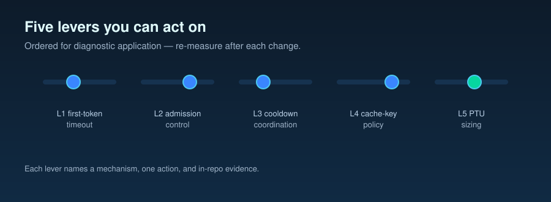

# Operator Guide — Operator Levers for Provisioned Throughput Unit (PTU) + Reasoning Workloads

> **Forwardable one-pager.** A single page an engineer or architect running an Azure OpenAI reasoning-model deployment can act on without consulting any other repo file. Each lever names the mechanism, one concrete action, in-repo evidence, and an Azure docs URL. Numbers cited here are the measured shape of the in-repo deployment, not a customer attribution; transfer to your deployment by re-measuring after each change.

## 1. Who this is for

An engineer or architect operating an Azure OpenAI deployment that serves a reasoning model (e.g. `gpt-5.2`) on provisioned throughput units (PTUs, fixed blocks of dedicated capacity) or pay-as-you-go (PAYG, shared capacity billed per token), with or without spillover (Azure automatically routing overflow requests from a saturated provisioned deployment to a standard one), looking for the operational knobs with measured or methodology-grade effect on cost, latency, cache behavior, and 429 (HTTP rate-limit) onset. Levers **L1–L5** below are ordered for diagnostic application, not by magnitude; **L6** (loop / budget governance) is a different class — it governs the multi-call loop that wraps L1–L5, not a single call.

## 2. The levers

### L1. First-token timeout in the saturated window

**Mechanism.** When the primary deployment is near saturation, the client-side first-token timeout decides how long a request sits "throttled-but-not-yet-rerouted." A shorter timeout shrinks that window; a longer one inflates tail latency without changing cost.

**Action.** Make `first_token_timeout_ms` an explicit per-deployment setting (Phase 1 / Phase 2 default `3000`). Tune from observed sustain time-to-first-token (TTFT) at p50/p95 (the median and 95th-percentile marks), not from a vendor default copied forward.

**In-repo evidence.** `benchmarks/04-spillover-simulation/analysis.md` §7 — sustain TTFT p50/p95 reactive `8,490.6 / 13,617.5 ms`, proactive `7,620.9 / 12,107.8 ms`. `benchmarks/05-dual-spillover/README.md` + committed `runs/*.summary.json` — Phase 2 reactive `7,383.3 / 11,967.2 ms`, proactive `10,239.9 / 34,631.7 ms` across two real deployments with real 429s.

**Azure docs.** <https://learn.microsoft.com/en-us/azure/ai-foundry/openai/how-to/responses>

### L2. Spillover policy — native vs proactive custom router

**Mechanism.** Azure-native spillover (`spilloverDeploymentName`) is reactive and PTU-scoped: it activates when the primary returns 429 and requires a PTU primary plus a configured target. Custom client-side routers can be proactive (route before the primary throttles) but pay for that with extra primary 429s when the heuristic mis-fires.

**Action.** Default to native spillover when the deployment topology supports it (PTU primary, sibling target, `spilloverDeploymentName` set). Build a proactive custom router only when native is unavailable or the workload's saturation signal demonstrably leads the 429.

**In-repo evidence.** Native spillover head-to-head did not run in this repo: `benchmarks/09-native-spillover/FEASIBILITY_FINDING.md` records the current deployment as `PAYG/GlobalStandard` with `spilloverDeploymentName=False`, so the feasibility gate closed at Stage 0 (`INFEASIBLE-AS-SPEC'D`). Proactive-vs-reactive custom-router behavior is in `benchmarks/04-spillover-simulation/analysis.md` §5 (sustain cache hit gap proactive − reactive `−0.1657 pp`) and `benchmarks/05-dual-spillover/` `runs/*.summary.json` (proactive `167` real primary 429s vs reactive `0`).

**Azure docs.** <https://learn.microsoft.com/en-us/azure/ai-foundry/openai/how-to/spillover-traffic-management>

### L3. System prompt stability

**Mechanism.** Cache invalidation is byte-exact: a single character change to the system prompt flushes the cacheable prefix. The next request bills the full input rate (not the cached-input rate) until the new prompt re-warms. The migration-era "cache hit dropped" symptom often resolves to this when the prompt was edited as part of the migration.

**Action.** Compute and log `sha256(system_prompt)` per request. Alert on any new hash not introduced by an intentional, approved prompt edit. Re-baseline cache hit ratio after every intentional edit.

**In-repo evidence.** `docs/05-methodology.md` §2 (controlled variables: byte-identical across efforts; "even a single character change in the system prompt flushes the cache"). `docs/07-cache-hit-degradation.md` §2 Hypothesis A (mechanism + diagnostic recipe). Operational tooling pattern: `benchmarks/05-dual-spillover/README.md` per-request capture schema (`cell_metadata.system_prompt_sha256`).

**Azure docs.** <https://learn.microsoft.com/en-us/azure/ai-foundry/openai/how-to/prompt-caching>

### L4. Reasoning effort tuning

**Mechanism.** `reasoning_effort` is per-request and reasoning tokens bill at the output rate while being invisible in the response. Higher tiers spend more reasoning tokens without necessarily lifting quality. On short-factual tasks reasoning tokens are ≈ 0 so the cost curve is flat from `none` up; on multi-step tasks the lowest non-zero effort already captures the quality lift.

**Action.** Default new traffic to `none` (the lowest measured effort level; the live gpt-5.2 deployment rejects `minimal` with HTTP 400); raise per task class only when the task's quality evaluation justifies it. Never default to `high` or `xhigh`.

**In-repo evidence.** `docs/04-decision-framework.md` (Q1–Q3 routing tree). `benchmarks/01-short-factual/analysis.md` §5/§10 — `none` at `$0.000587 ± $0.000124 / req` vs `gpt-4o` `$0.000665 ± $0.000089` (12 % PAYG saving) at a marginally higher judge score (`1.95` vs `1.90`); with reasoning tokens ≈ 0, no tier above `none` raises quality or, materially, cost. `benchmarks/02-multi-step-reasoning/` via `results/summary.md` §3 — `effort = none` `$0.000618 / correct` vs `gpt-4o` `$0.001064` (42 % PAYG saving).

**Azure docs.** <https://learn.microsoft.com/en-us/azure/ai-foundry/openai/how-to/reasoning>

### L5. `max_output_tokens` tightening (TBD: Task 019 v2.3 evidence)

**Mechanism.** On PTU, `max_output_tokens` is an admission-time reservation, not a soft cap: inflating it for reasoning headroom silently reduces effective concurrency, so 429s surface at a lower admitted requests-per-minute rate (RPM) while the bill per completed request is unchanged. The lever is *tightening*, not removing.

**Action.** Per call class, set `max_output_tokens = ceil((p99_visible + p99_reasoning) × 1.15)` from a representative production sample. Treat one-off long answers as per-call overrides, not a global cap raise.

**In-repo evidence.** Mechanism + diagnostic recipe: `docs/07-cache-hit-degradation.md` §10 (Hypothesis I — monotone reservation effect). Operational tightening rule: `docs/08-customer-simulation-findings.md` §5 L5. `benchmarks/07-max-output-tokens-reservation/analysis.md` owns the controlled `[256 … 16384]` sweep on a throttled deployment with spillover disabled; the v2.3 evidence run is pending and headline tables are TBD. Apply the tightening rule now and re-measure 429-onset RPM at the new cap vs the inflated baseline.

**Azure docs.** <https://learn.microsoft.com/en-us/azure/ai-foundry/openai/concepts/provisioned-throughput>

### L6. Loop / budget governance (governs the multi-call loop, not one call)

**Mechanism.** L1–L5 each bound a single call or deployment; none bounds the *number* of calls a tool-using / agentic task makes or its *cumulative* spend. A loop's bill is the integral over steps, so without a step cap **and** a cumulative cost ceiling it can run away — the growing transcript re-sent each step (which also flushes the L3 cache prefix) makes the late steps the most expensive.

**Action.** Wrap any multi-call task in: a per-task `max_iterations` step cap and a `hard_ceiling_usd` cost ceiling; a fail-closed circuit-breaker that aborts on cap / ceiling / no-progress and records a typed termination reason; eval-gated continuation (loop again only when a `run_judge`-style rubric says it will pay); and per-step cost traceability (`loop_id`, `step_index`, `cumulative_cost_usd`, `budget_remaining_usd`). Own the thresholds as committed, reviewed policy.

**In-repo evidence.** This repo's measurement runner already implements the pattern: `scripts/run_benchmark.py` carries a `BudgetTracker` hard-ceiling halt (`BudgetExceededError`, `EXIT_BUDGET`), a pre-run estimate gated by `MAX_COST_PER_BENCHMARK_USD`, and a tool-loop `max_iterations` cap that fires a final answer-only call and records `tool_loop_terminated="iteration_cap"`. `docs/05-methodology.md` §6 "Budget guards" frames it as methodology, not hygiene. Full treatment: `docs/18-agentic-loop-budget-governance.md`.

**Azure docs.** <https://learn.microsoft.com/en-us/azure/ai-foundry/openai/how-to/reasoning>

## 3. Five-step diagnostic recipe

1. **Capture per-request fields:** `response.usage` (including `prompt_tokens_details.cached_tokens` and `completion_tokens_details.reasoning_tokens`), `prompt_cache_key`, `max_output_tokens`, `sha256(system_prompt)`, `retry-after-ms`.
2. **Identify the symptom in Azure Monitor:** Utilization V2, Cache Match Rate, TTFT, 429 rate — bucket per minute over the affected window.
3. **Match the symptom to a hypothesis** in `docs/07-cache-hit-degradation.md` §§2–10 (A–I) using the per-architecture flowchart in §11.
4. **Apply the matching lever (L1–L5)** above as the single change for that window. Change one lever at a time.
5. **Re-measure for at least one week** before drawing a conclusion; day-of-week and time-of-day mix dominate shorter windows.

## 4. What you cannot fix with this guide

- **System prompt content.** L3 protects byte-stability; it does not decide what the bytes should be. Content is gated by your safety and quality teams.
- **PTU sizing.** Throughput-gain framing in L4 / L5 is a token-pressure proxy, not a billed PTU magnitude; sizing decisions need deployment-side capacity data this repo does not have.
- **Single-call ReAct (reasoning-and-acting) planning variance** (Hypothesis H′). Mechanism named in `docs/07-cache-hit-degradation.md` §9; magnitude unmeasured — architectural, not a knob.

## 5. Where to go next

- `docs/04-decision-framework.md` — task → model × effort routing
- `docs/18-agentic-loop-budget-governance.md` — L6 in full: governing the multi-call loop (thresholds, intervention, evals, traceability, governance)
- `docs/07-cache-hit-degradation.md` — full hypothesis enumeration (A–I)
- `docs/08-customer-simulation-findings.md` — end-to-end pattern with two-lens (PAYG / PTU) translation
- `docs/05-methodology.md` — measurement contract every number above resolves to
- PTU vs PAYG translation: see the README "Which Customer Are You?" section. The previously planned `docs/06-ptu-vs-paygo.md` cross-reference is not present in this repo snapshot.
