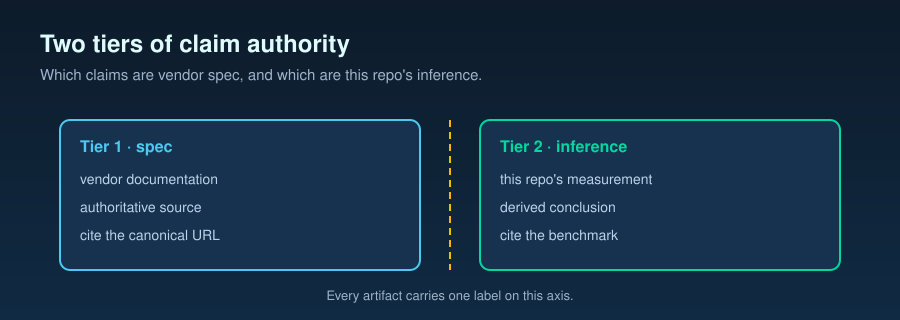

# Spec vs inference taxonomy — Tier 1 / Tier 2 citation contract

**Task 029 anchor.** This document specifies the two-tier citation
taxonomy that every doc, docstring, and per-field schema tag in this
repo follows. It is the methodology capstone for Tasks 023–028.



It does NOT replace, edit, or supersede
`docs/05-methodology.md` (Task 001 — reproducibility contract; frozen).
It layers on top: where Task 001 says *how* a measurement is
reproducible, Task 029 says *which* claims are vendor spec and which
are this repo's inference.

The library backing this taxonomy is
`batch_runner.methodology.citation` (Tier 1 / Tier 2 / Citation /
assert_well_formed / render_for_docstring / render_for_doc_footer).
Worked examples live in `docs/15-spec-vs-inference-taxonomy.examples.md`.

---

## 1. Why two tiers

The Azure OpenAI PTU Operations Guide front matter states (internal
Guide §0 — treated as Tier 2 per §3 below, since the internal Guide
is not a public Microsoft Learn / OpenAI / Azure source):

> "All technical claims are grounded in Microsoft Learn public
> documentation, with 'official spec' and 'operational inference'
> clearly distinguished throughout."

That editorial convention is the Guide's authority model. This repo
inherits it. Without an explicit taxonomy, every artifact would have
to re-litigate where the line falls between "Microsoft says" and "we
observed". With a taxonomy and a citation library, the line is drawn
once and audited mechanically.

---

## 2. Tier 1 — Official Spec

**Definition.** A claim whose exact wording can be found in one of the
accepted upstream sources, accessed on a known date.

**Accepted sources.**

- Microsoft Learn pages (`learn.microsoft.com`, `docs.microsoft.com`)
- OpenAI public documentation (`platform.openai.com`, `openai.com`)
- Azure REST API references on `learn.microsoft.com`
- Pinned Azure / OpenAI SDK source identified by file, line, and
  version tag (for example `Azure SDK Python: openai/_base_client.py
  L417 (v1.42.0)`)

**Citation format (mandatory).**

- The URL or pinned-SDK identifier
- ISO `YYYY-MM-DD` access date
- A verbatim quote where the exact wording is load-bearing

**Not accepted as Tier 1.** In-repo benchmark analyses; field
engagement notes; internal chat transcripts; partner-only collateral;
any source whose wording can drift without a public-doc commit.

**Why URL + date are mandatory.** Microsoft Learn revises pages in
place. A bare URL with no date provides no drift detection. The
access date pins the wording to a moment in time so a future audit can
compare against an Archive.org snapshot if Learn changes.

Citation for this section: Guide §0 editorial convention (Tier 2 —
internal Guide is not public, so its framing is cited verbatim but
treated as operational inference per §3). Rationale: the two-tier
idea originates with the Guide; the upstream Microsoft Learn
documents do not themselves define this taxonomy.

---

## 3. Tier 2 — Operational Inference

**Definition.** A claim supported by one or more of:

- This repo's measurements (Tasks 013, 019, 020, 024, 026 outputs)
- External field observation
- A reasonable interpretation of Tier 1 sources that goes beyond what
  those sources say verbatim

**Citation format (mandatory).** Either:

- An in-repo path with section context, for example
  `benchmarks/07-max-output-tokens-reservation/analysis.md §3`, OR
- A short labeled rationale paragraph (>= 20 characters) naming the
  inference and naming its limits

Access date is optional for in-repo paths because the repo is
git-versioned; the commit SHA at audit time pins the wording.

**Tier 2 claims MUST be labeled.** In code, via
`render_for_docstring(Citation(tier=Tier.OPERATIONAL_INFERENCE, ...))`.
In docs, via the prefix `**Tier 2 (operational inference)**` in the
section-end Citations block.

Citation for this section: internal repo convention (Tier 2 —
rationale: this is the convention Task 029 is publishing; it is
self-referential by construction).

---

## 4. Why this matters

1. **Auditability.** A reader can mechanically check whether a claim
   is grounded in a public Microsoft document or in this repo's
   measurements.
2. **Customer trust.** A customer can forward a Tier 1 claim with
   confidence (it is Microsoft's). They can evaluate a Tier 2 claim on
   its rationale (it is ours).
3. **Drift detection.** When Microsoft updates a Learn page, the ISO
   access date on every Tier 1 cite tells us which assertions need to
   be re-validated.
4. **Honest framing.** Some Guide assertions are interpretations of
   Microsoft documentation, not Microsoft commitments. The taxonomy
   forces that distinction into the open.

---

## 5. How to label in code

```python
from batch_runner.methodology import Citation, Tier, render_for_docstring

CITE_RETRY_AFTER_MS = Citation(
    tier=Tier.OFFICIAL_SPEC,
    source="https://learn.microsoft.com/azure/ai-services/openai/concepts/provisioned-throughput",
    access_date_iso="2026-05-28",
    quoted_excerpt="retry-after-ms ... next acceptable request time",
)

CITE_30S_CEILING = Citation(
    tier=Tier.OPERATIONAL_INFERENCE,
    source="benchmarks/03-admission-controller/analysis.md §4",
    rationale="Empirical p99 of retry-after-ms in Task 020 sits under "
              "30 s; the controller caps at 30 s as a conservative ceiling.",
)
```

`batch_runner.observability.schema` carries per-field category tags
that use exactly these two enum values; see `docs/14-observability-schema.md`
for the worked example.

---

## 6. How to label in docs

Each Markdown section may end with a `### Citations` block. Tier 1
bullets carry the URL and access date; Tier 2 bullets carry the
rationale.

```
### Citations

- **Tier 1 (official spec)** — https://learn.microsoft.com/... — accessed 2026-05-28
  > "verbatim quote here"
- **Tier 2 (operational inference)** — benchmarks/.../analysis.md §3
  Rationale: short paragraph naming the inference and its limits.
```

Inline cites use `[T1]` and `[T2]` prefixes when brevity matters. The
full citation must still appear in a Citations block at the section
end.

---

## 7. When a Tier 2 claim graduates to Tier 1

A Tier 2 claim is promoted to Tier 1 only when a Microsoft Learn /
OpenAI / Azure SDK source adopts the same wording. The promotion is
made in a documented commit that:

1. Adds the Tier 1 Citation with URL and ISO access date.
2. Removes the Tier 2 Citation in the same change.
3. Notes the promotion in CHANGELOG.md.

The reverse — silently re-labeling a Tier 2 claim as Tier 1 — is not
permitted.

---

## 8. Where this applies

- **Tasks 023–028** carry per-claim labels using this taxonomy.
- **Task 028** observability schema tags every field with one of the
  two enum values.
- **Future task templates** inherit the library and the convention
  without further methodology work.

This taxonomy does NOT apply retroactively to immutable artifacts:
benchmark `analysis.md` files post-APPROVE remain frozen.

---

## 9. What this taxonomy does NOT do

- It does not adjudicate Hypothesis A–I status. Task 011 owns the
  hypothesis-evidence framing; the two are orthogonal.
- It does not modify any benchmark `analysis.md`.
- It does not modify `docs/05-methodology.md` (frozen by Task 001).
- It does not modify `.internal/REPO_SCAFFOLD_SPEC.md`.
- It does not authorize promoting any Tier 2 claim to Tier 1 without
  a public Microsoft Learn / OpenAI / Azure SDK source adopting the
  same wording.
- It does not introduce a new dependency; the library is stdlib-only.

---

## Citations

- **Tier 1 (official spec)** — https://learn.microsoft.com/azure/ai-services/openai/concepts/provisioned-throughput — accessed 2026-05-28
  > "retry-after-ms ... next acceptable request time"
- **Tier 1 (official spec)** — https://learn.microsoft.com/azure/ai-services/openai/how-to/spillover-traffic-management — accessed 2026-05-28
- **Tier 1 (official spec)** — https://learn.microsoft.com/azure/ai-services/openai/how-to/prompt-caching — accessed 2026-05-28
- **Tier 2 (operational inference)** — Guide §0 editorial convention
  Rationale: the two-tier idea originates with the internal Guide; upstream Microsoft Learn pages do not themselves define this taxonomy, so its framing is treated as inference, not spec.
- **Tier 2 (operational inference)** — internal repo convention (this file)
  Rationale: the labeling convention published here is self-referential by construction; future repo tasks inherit it without re-justification.
