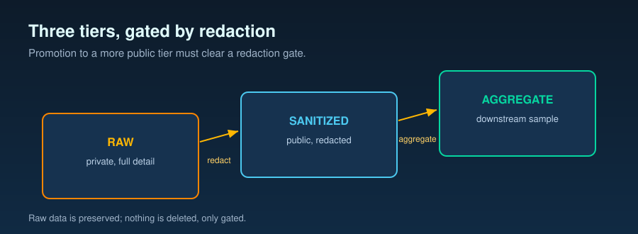

# Release tiers and redaction policy

**Public-facing release governance for this repository.** This document
defines the three-tier data classification used by every artifact in
this repo, the redaction rules that gate promotion between tiers, the
raw-data preservation rule, the per-surface tier permission matrix for
each public publication channel, and the governance / readiness
checklist a maintainer follows before any public release.

It is a companion to:

- `docs/05-methodology.md` (reproducibility contract — frozen) — how a
  measurement is reproducible and which reproducibility claims are public.
- `docs/14-observability-schema.md` (canonical record contracts for
  individual requests and aggregate measurement windows) — *which* fields
  exist. This document classifies
  those fields by publication sensitivity.
- `docs/15-spec-vs-inference-taxonomy.md` (Tier 1 / Tier 2 claim-authority
  taxonomy) — *which* claims are vendor spec and which are this repo's
  inference. Orthogonal axis. A single artifact carries both a
  claim-authority label (spec / inference) and a release tier label
  (raw / sanitized / aggregate).
- `docs/17-foundry-packaging-relationship.md` — how this repo relates to
  the downstream Microsoft Foundry sample repo and to the public Pages
  surface.

---

## 1. Why three tiers

Two failure modes drive the design: (1) **leakage** — raw outputs
carry endpoint URLs, deployment names, request IDs, regions, and
free-text payloads that may encode workload fingerprints; (2) **loss
of scientific record** — deleting raw outputs to make publishing
easier destroys the primary evidence behind every public claim. The
three tiers separate the original scientific record from the
publishable derivative and the operator-facing aggregate. Each tier
has a fixed redaction bar and a fixed set of surfaces it is allowed
to appear on. Promotion is one-directional: raw → sanitized →
aggregate. Demotion is not defined.

---

## 2. The three tiers

### 2.1 `RAW_PRIVATE`

**Definition.** Original, unmodified output of an experiment run.
Full Azure response headers (request IDs, region, deployment-name
headers, rate-limit counters), exact prompt / response pairs, exact
deployment names, exact endpoint URLs, exact experiment YAML inputs.

**Storage.** Held in a private, owner-controlled archive that is not
part of the public mirror. Indexed by a manifest that records, per
file: a SHA-256 of the file contents, the run identifier, a hash of
the experiment YAML that produced it, the wallclock capture timestamp
(UTC), and the git commit SHA of the producing code.

**Preservation.** **Raw experiment data is never deleted.** It is the
primary scientific record. Any workflow proposing to remove a raw
output instead *moves* the file into the private archive and records
a manifest entry. The redaction tooling is read-only against the
archive (reads from archive, writes a sanitized derivative to a
public tree, never modifies or removes the source).

**Publication.** Forbidden. `RAW_PRIVATE` content does not appear in
the public research repo, the Pages dashboard / blog, the Microsoft Foundry sample
repo, social-share previews, analytics payloads, build artifacts, or
source maps. Any surface
that detects a `RAW_PRIVATE` input MUST fail its build.

### 2.2 `SANITIZED_PUBLIC`

**Definition.** A derivative of `RAW_PRIVATE` produced by applying
the redaction rules in §3. Same scientific content (same per-request
rows, per-cell aggregations, numeric series) with sensitive fields
removed, replaced, or pseudonymized.

**Required transforms** (per-field rules in §3): endpoint URLs
removed or replaced with a placeholder; deployment names replaced
with stable pseudonyms (`ptu-deploy-a`, `payg-deploy-b`) via a
one-way mapping held only in the private archive; region tags,
request IDs, and deployment-name response headers dropped; customer-
shape fingerprints (prompts that encode a specific workload's data
shape, schema, or identifier ranges) replaced with synthetic
equivalents or dropped where no synthetic exists; secret patterns
(application programming interface (API) keys, bearer tokens, signed URL parameters, account keys) MUST
be absent (a detected secret aborts the redaction run with a
non-zero exit; the run does not produce a partial public artifact);
wallclock timestamps rounded to the nearest UTC hour.

**Provenance.** Provenance for every `SANITIZED_PUBLIC` artifact is
recorded as one entry in the single tracked public manifest
`release/public_sanitized_manifest.json` (the canonical provenance
record for this repo). Each entry is keyed by the sanitized artifact's
repo-relative path and carries: the SHA-256 of the artifact in its
current publishable form (`sanitized_sha256`), the SHA-256 of its
source `RAW_PRIVATE` file (`source_raw_sha256`), an opaque
`source_archive_id` for cross-reference into the private archive, the
SHA-256 of the public-safe description of the redaction rules used
(`redaction_rules_sha256`), the SHA-256 of the redactor script bytes
(`redactor_script_sha256`), the redaction timestamp (UTC), the git
commit SHA of the redactor code, and a `sweep_id`. The on-disk
private archive path is *not* recorded in the public manifest —
references back to the source are only by opaque id and SHA-256.
Legitimate downstream edits to a previously-sanitized public file
that do not reintroduce any forbidden token are tracked by re-running
`scripts/sanitize_public_artifacts.py --apply`, which refreshes the
entry's `sanitized_sha256` to the new on-disk sha while leaving
`source_raw_sha256` and `source_archive_id` pinned to the original
`RAW_PRIVATE` source. When the private archive is not available (a
public-tree edit, a contributor clone, or a continuous integration (CI)-adjacent environment),
the identical re-pin is available offline via
`scripts/sanitize_public_artifacts.py --refresh-hashes`: it updates
only the `sanitized_sha256` of already-listed, in-scope, token-clean
entries, never reads the private archive, and never adds or removes
entries. It refuses any file that reintroduced a forbidden token
(those must go through `--apply`, which archives the raw original and
redacts). This decouples the `--verify` drift signal from the
owner-only `--apply` regeneration so a stale hash can be corrected
wherever the edit was made. One central manifest is functionally equivalent
to a sidecar file per artifact (every `SANITIZED_PUBLIC` artifact has
exactly one provenance entry) while keeping the working tree free of
several thousand sidecar files. The hash of the redaction rules is
computed over a public-safe canonical description (class labels,
placeholder outputs, ordering rule) — *never* over the private
workload tokens themselves, because a deterministic hash of low-
entropy private values would otherwise act as an offline confirmation
oracle. Per-file sidecar manifests and first-JSONL-row provenance
records are not used in this repo; any future surface that adds them
MUST also represent the same provenance in the central manifest so
that the central manifest remains the single source of truth.

**Publication.** Allowed in the public research repo (this repo,
once made public) and in chart series consumed by the Pages dashboard /
blog.

### 2.3 `AGGREGATE_AZURE_SAMPLE`

**Definition.** Per-cell or per-experiment aggregations only; no
per-request rows. Designed for inclusion in a downstream Microsoft
Foundry sample repo whose audience is operator-facing (decision
tables, throughput / cost curves) and for whom per-request payloads
carry no decision value.

**Required transforms.** All `SANITIZED_PUBLIC` transforms apply,
plus: per-request rows removed (only summary statistics remain:
count, mean, median, 95th-percentile latency (p95), p99 (99th-percentile), standard deviation, cell identifier);
free-text prompt / response fields removed entirely (only task profile
metadata such as token counts, latency, status-code histograms
remains); pseudonymized deployment names further generalized to role
labels (`ptu-primary`, `ptu-spillover`, `payg-baseline`); cells with
`n < 5` dropped to prevent re-identification by row count.

**Provenance.** Each `AGGREGATE_AZURE_SAMPLE` artifact carries the
list of contributing `SANITIZED_PUBLIC` source SHA-256s, the SHA-256
of the aggregation script, and the semver of the aggregate schema.

**Publication.** Primary surface is the downstream Microsoft Foundry
sample repo. MAY also appear in the public research repo as a
convenience summary alongside the `SANITIZED_PUBLIC` per-request
data, but does not replace it.

### 2.4 Public reproducibility scope

Release tiers classify data; they do not make all forms of reproduction
public. The aligned scope is:

| Level | Availability at the public boundary |
| --- | --- |
| **Public evidence verification** | **Publicly verifiable** for published `SANITIZED_PUBLIC` and `AGGREGATE_AZURE_SAMPLE` bytes, hashes, and public analysis inputs. |
| **Same-method rerun on a new environment** | Available to a reader using the committed method and a new environment, with provider access where the selected path requires it. A rerun targets the same profile, not byte identity. |
| **Exact original raw reproduction** | Not publicly available. It is **owner-auditable** against the preserved `RAW_PRIVATE` archive and owner-only redaction inputs. |

`source_raw_sha256` is an opaque commitment to the source bytes. A public
reader does not possess those bytes, so the value cannot independently prove
their contents, reconstruct them, or reproduce the raw-to-public
transformation. “Publicly verifiable” and “owner-auditable” therefore must not
be used interchangeably. This boundary never permits `RAW_PRIVATE`
publication.

---

## 3. Redaction rule categories

The redaction rule set is implemented as a declarative configuration
held in the private working tree. Categories below are summarized for
public documentation; the live configuration is the source of truth
for any operational sweep.

| Category | Detection | Action | `SANITIZED_PUBLIC` | `AGGREGATE_AZURE_SAMPLE` |
|---|---|---|---|---|
| Secrets | regex on common key / token / signed-URL / account-key patterns and environment-variable names | abort the run | abort | abort |
| Endpoint URLs | regex on Azure OpenAI / Cognitive Services hostnames | replace with placeholder | required | required |
| Deployment names | field-name match on request and response deployment headers and on YAML-side deployment identifiers | pseudonym via one-way map | required | further generalized to role labels |
| Region | field-name match on the region response header | drop | required | required |
| Request IDs | field-name match on request-id and correlation-request-id response headers | drop | required | required |
| Wallclock timestamps | field-name match on capture / start / end timestamps | round to nearest UTC hour | required | required |
| Customer-shape fingerprints | prompt-content allow-list (only synthetic prompts pass; private-corpus prompts are dropped) | drop or replace with synthetic | required | required |
| Free-text payloads | field-name match on prompt, response, message content, tool-call arguments | retain in `SANITIZED_PUBLIC`; drop in `AGGREGATE_AZURE_SAMPLE` | retain | drop |
| Internal hostnames | regex on `*.internal`, RFC 1918 ranges, common corp suffixes | drop or replace | required | required |
| Email addresses | RFC 5322 regex | drop | required | required |
| Workload-identifying names | curated deny-list held privately | abort the run if matched | abort | abort |

Two design choices are deliberate: **customer-shape redaction is
allow-list**, not deny-list (a prompt from a private workload corpus
is dropped, not transformed, because semantic fingerprints can
survive lexical scrubbing); **secret detection aborts**, not redacts
(allowing partial output would mask the source of the leak and could
publish a near-secret in an adjacent field).

---

## 4. Per-surface tier permission matrix

Each public surface consumes only the tiers listed for it. A surface
that detects an unlisted tier MUST fail its build.

| Surface | `RAW_PRIVATE` | `SANITIZED_PUBLIC` | `AGGREGATE_AZURE_SAMPLE` |
|---|---|---|---|
| Public research repo (this repo, made public) | forbidden | allowed (per-request rows + per-cell aggregations) | allowed (as convenience summary alongside sanitized data) |
| GitHub Pages dashboard / blog | forbidden | allowed (chart series, per-request rows referenced by sanitized path) | allowed (decision tables, throughput / cost curves) |
| Downstream Microsoft Foundry sample repo | forbidden | forbidden (per-request rows are not part of the Microsoft Foundry sample contract) | allowed (primary surface) |

Notes on the matrix:

- The Pages dashboard / blog is the canonical public surface for any
  public numeric claim in this repo.
- The Microsoft Foundry sample repo is `AGGREGATE_AZURE_SAMPLE`-only on purpose:
  per-request rows are the public research repo's contract with
  researchers, not the Microsoft Foundry sample's contract with operators.
- A single artifact may carry more than one tier label across its
  lifecycle (raw in the private archive, sanitized in the public repo,
  aggregate in the Microsoft Foundry sample).

---

## 5. Data and charts — allowed tiers

| Artifact type | Allowed tiers for publication |
|---|---|
| Per-request JSONL records | `SANITIZED_PUBLIC` only |
| Per-cell summary statistics | `SANITIZED_PUBLIC` or `AGGREGATE_AZURE_SAMPLE` |
| Throughput / latency / cost curves | `SANITIZED_PUBLIC` or `AGGREGATE_AZURE_SAMPLE` (sourced from numeric series of either tier) |
| Decision tables (provisioned throughput unit (PTU) vs pay-as-you-go (PAYG), lever-effect summaries) | `AGGREGATE_AZURE_SAMPLE` preferred; `SANITIZED_PUBLIC` allowed when the table is built from sanitized per-cell summaries |
| Free-text prompt / response excerpts | `SANITIZED_PUBLIC` only, and only when the excerpt is synthetic (allow-list); never in `AGGREGATE_AZURE_SAMPLE` |
| Header captures (region, request ID, deployment name) | none — these fields are removed before any public tier |
| Endpoint URLs | none — removed or placeholdered before any public tier |
| Secrets of any kind | none — detection aborts the run |

Chart series data files consumed by the Pages dashboard MUST be
locale-agnostic (numeric series plus metric / dimension keys only).
Per-locale label bundles are separate; one dataset, N label bundles.
This rule is restated in `docs/17-foundry-packaging-relationship.md`.

---

## 6. Raw-data preservation rule (HARD)

> **Original raw experiment data MUST NOT be deleted.** It is
> archived to an owner-controlled private location, indexed by
> manifest, and linked from every public derivative by SHA-256. Any
> downstream task, script, or workflow that proposes deleting a raw
> run artifact, a log file, a judge transcript, or an intermediate
> result file MUST instead *move* the file to the private archive
> and write a manifest entry.

Concrete obligations:

- The redaction tooling operates as a *read-from-archive, write-to-
  public-tree* transform. It does not modify or remove the source.
- If a `RAW_PRIVATE` file is found on a public-tree path during the
  pre-release audit, it MUST be moved (not copied, not deleted) to
  the private archive, and a `SANITIZED_PUBLIC` derivative MUST be
  written in its place before any public release.
- The private archive MUST have a secondary backup (owner-chosen
  mechanism) before any public release, verified at the §8.3
  readiness gate.
- Manifest integrity MUST be re-verified (recompute SHA-256 across
  the archive, compare to manifest) at any release readiness check.

The scientific record is irrecoverable: a measurement gone from the
archive cannot be re-run identically (upstream service moves,
deployment topology changes, pricing changes). Public derivatives
are *links into* the archive by hash; breaking the archive breaks
the reproducibility of every prior public claim.

---

## 7. Channel-level rules (summary)

Detailed per-channel rules — canonical Pages source-of-truth and
downstream Microsoft Foundry sample packaging — live in
`docs/17-foundry-packaging-relationship.md`. Tier-level invariants
each channel inherits from this document:

- **Public research repo.** `SANITIZED_PUBLIC` and
  `AGGREGATE_AZURE_SAMPLE` only. Methodology, hypothesis ledger,
  decision tools, citation taxonomy, sanitized benchmark slices.
- **Pages dashboard / blog.** Canonical surface for public-facing
  essays, analyses, chart series, and numeric claims. i18n-first
  with initial locales `ko`, `en`, `ja`, `zh-CN`, `hi` (Hindi
  represents "Indian language"; additional Indian languages added
  only by explicit owner decision). `SANITIZED_PUBLIC` and
  `AGGREGATE_AZURE_SAMPLE` only.
- **Downstream Microsoft Foundry sample repo.** Separately named,
  separately governed. `AGGREGATE_AZURE_SAMPLE` only. Cites the
  public research repo and does not author methodology.

---

## 8. Governance and release-readiness checklist

A maintainer runs this checklist before any public release (public
research repo flip, Pages publication, or downstream Microsoft Foundry sample
release). The checklist is the same across surfaces; the per-surface
scope differs.

### 8.1 Tier-label and provenance gates

- [ ] Every artifact proposed for publication carries an explicit tier
  label (`RAW_PRIVATE` / `SANITIZED_PUBLIC` / `AGGREGATE_AZURE_SAMPLE`).
- [ ] No artifact carrying the `RAW_PRIVATE` label appears on any
  public-tree path. Any such file has been moved to the private
  archive and replaced with its `SANITIZED_PUBLIC` derivative.
- [ ] Every `SANITIZED_PUBLIC` artifact has a corresponding entry in
  the central tracked public manifest
  `release/public_sanitized_manifest.json` with: source raw SHA-256,
  sanitized SHA-256, opaque `source_archive_id`, redaction-rules
  SHA-256, redactor-script SHA-256, redaction timestamp (UTC),
  redactor commit SHA, and `sweep_id`. The public manifest contains
  no private filesystem path (no references to the private archive
  tree), no endpoint URLs, no deployment names, and no secret
  patterns. The
  release-readiness CI job runs `python scripts/sanitize_public_artifacts.py
  --verify --require-public-manifest` and fails if the manifest is
  missing, drifted, internally inconsistent, or any entry's on-disk
  artifact SHA-256 disagrees with the recorded `sanitized_sha256`.
  Drift from a legitimate, token-clean edit is repaired from the public
  tree with `--refresh-hashes` (no private archive); adding or
  re-redacting an artifact uses `--apply`.
- [ ] Every `AGGREGATE_AZURE_SAMPLE` artifact carries the list of
  source `SANITIZED_PUBLIC` SHA-256s, aggregation-script SHA-256, and
  schema semver.

### 8.2 Redaction-rule gates

- [ ] The redaction-detector CI job runs against the proposed
  publication set and reports zero matches in categories that abort
  (secrets, workload-identifying names).
- [ ] Endpoint URLs, deployment names (raw), regions, request IDs,
  internal hostnames, and email addresses have been removed or
  pseudonymized per §3.
- [ ] Wallclock timestamps have been rounded to the nearest UTC hour
  in every `SANITIZED_PUBLIC` artifact.
- [ ] Customer-shape redaction has been verified against the allow-
  list (no private-corpus prompts present).
- [ ] Cells with `n < 5` have been dropped from `AGGREGATE_AZURE_SAMPLE`
  artifacts.

### 8.3 Raw-archive integrity gates

- [ ] Manifest hashes have been recomputed against the private archive
  and match the recorded manifest entries.
- [ ] Secondary backup of the private archive is current.
- [ ] No raw run artifact, log file, judge transcript, or intermediate
  result file has been deleted as part of the release preparation;
  any such file was moved to the archive with a manifest entry.

### 8.4 Per-surface gates

- [ ] **Public research repo:** community-health files present
  (`LICENSE`, `CODE_OF_CONDUCT.md`, `CONTRIBUTING.md`, `SECURITY.md`,
  issue / PR templates, CODEOWNERS for methodology-frozen files, CI
  with redaction-detector and methodology-freeze jobs, dependency
  scan, `CHANGELOG.md` in Keep-a-Changelog format, `GOVERNANCE.md`).
- [ ] **Pages dashboard / blog:** locale-prefixed routes
  (`/en`, `/ko`, `/ja`, `/zh-cn`, `/hi`); per-page `hreflang` for all
  published locales plus `hreflang="x-default"` and a `canonical`
  link; per-translation status (`translated` / `machine_translated` /
  `stale` / `untranslated_fallback_to_en`) and `last_translated_at`
  timestamp; source-content hash check passed; glossary covers at
  minimum *Microsoft Foundry*, *PTU*, *PAYG*, *reasoning*, *cache*, *429* with
  a fixed per-locale translation; chart series data files are
  locale-agnostic.
- [ ] **Microsoft Foundry sample repo:** Microsoft sample-repo `LICENSE`
  verified with the Microsoft Foundry samples program; Microsoft Open Source
  `CODE_OF_CONDUCT.md`; MSRC `SECURITY.md`; `README.md` per the
  Microsoft Foundry sample template; notebooks runnable end-to-end on Microsoft
  Foundry with a pinned dependency manifest; per-file
  SPDX-License-Identifier headers; no reference to private customer
  engagements, private communication channels, or private task
  identifiers; `AGGREGATE_AZURE_SAMPLE` data only; `PROVENANCE.md`
  links back to the public research repo at the pinned commit SHA.

### 8.5 Stop-the-release conditions

Any of the following stops the release until remediated:

- A secret pattern detected in any candidate artifact.
- A workload-identifying name detected in any candidate artifact.
- A `RAW_PRIVATE` artifact on a public-tree path.
- A `SANITIZED_PUBLIC` artifact missing its entry in
  `release/public_sanitized_manifest.json`, or an
  `AGGREGATE_AZURE_SAMPLE` artifact missing its provenance manifest.
- A Pages translation whose source-content hash differs from the
  recorded translation-time hash (the page is marked `stale` and the
  user-visible banner is shown; the release proceeds only with the
  stale banner visible, or after re-translation).
- A Microsoft Foundry sample artifact carrying per-request rows.

---

## 9. Relationship to other documents

- `docs/05-methodology.md` (reproducibility contract — frozen):
  methodology defines *how* a measurement is reproducible and the three
  reproducibility levels; this document defines *which* slices are
  publishable.
- `docs/14-observability-schema.md`: redaction categories in §3 align
  field-by-field with the record schema. New fields added to the
  record contract are reviewed against §3 for tier classification
  before they appear in any publication candidate.
- `docs/15-spec-vs-inference-taxonomy.md`: orthogonal axis. Every
  published artifact carries both a claim-authority label (spec /
  inference) and a release tier label (raw / sanitized / aggregate).
- `docs/17-foundry-packaging-relationship.md`: Pages i18n-first
  acceptance bar and the Track A ↔ Track B Microsoft Foundry packaging
  relationship.

---

## 10. Audited public-surface boundary acceptances

The narrow CI gates (`scripts/check_public_surface.sh`,
`scripts/sanitize_public_artifacts.py --verify`, `docs/validate.sh`)
enforce that no *new* internal/public-boundary disclosure enters the
tracked tree. A separate, broad scan over the entire tracked surface
(run by a release reviewer with every narrow allowlist disabled) also
surfaces a small, fixed set of boundary *references* that are not
disclosures of private content and that are required for the public
repo to function as a reproducible scientific record. Those references
are enumerated and **explicitly accepted** below. Each is either a
self-referential enforcement mechanism, a synthetic test/placeholder
string, or an audited provenance citation. None reveals a real
endpoint, deployment, credential, customer-shape prompt, or private
file *content*. This list is exhaustive; any reference outside it is a
finding, not an accepted item.

### 10.1 `.gitignore` boundary-enforcement rules (self-reference)

`.gitignore` necessarily names the private surfaces it excludes:

- the private internal working tree (the `.internal` directory) is
  ignored so a stray `git add .` cannot track it;
- the internal worker-prompt directory (the `.github/agents` path) is
  ignored for the same reason, with a comment enumerating the private
  worker-prompt role names (analyzer, coder, extreme-reasoner,
  first-reviewer, frontend-developer, git-committer, llm-systems-engineer,
  measurement-engineer, strategy-consultant, ui-designer) so the intent
  of the ignore rule is auditable.

These strings are the *mechanism* that keeps the private surfaces out
of the public tree; they are accepted and must not be removed.
`.gitignore` is excluded from the narrow checkers for exactly this
reason.

### 10.2 Synthetic Azure endpoint / resource / host strings (test data)

The redaction sweep, the preflight spillover guard, and their unit
tests assert that real Azure endpoint URLs, resource short-names, and
Microsoft Foundry/Cognitive-Services hostnames are detected and scrubbed. Those
assertions require Azure-*shaped* but non-concrete placeholder strings
as fixtures and as the redactor's replacement outputs — for example
`example-host.services.ai.azure.com`,
`https://example.services.ai.azure.com`,
`fake.services.ai.azure.com`, `my-resource.openai.azure.com`,
`foo-bar-baz.cognitiveservices.azure.com`, the `wrpo-test-endpoint`
fixture host, and the deliberately-obvious `supersecret-resource`
negative-test host. These appear in the redaction tooling
(`scripts/sanitize_public_artifacts.py`) and in test files under
`tests/` (e.g. `tests/test_sanitize_public_artifacts.py`,
`tests/test_preflight_native_spillover.py`,
`tests/test_measure_dual_spillover.py`, `tests/test_run_benchmark.py`,
`tests/test_simulate_spillover.py`). They are synthetic by
construction — recognizable placeholder prefixes (`example-`, `fake.`,
`my-resource.`, `wrpo-test-`, `supersecret-`) or angle-bracket
pseudonyms (`<resource>`, `<project>`) — and are **accepted**. The
three concrete workload tokens that the sweep actually forbids
(`--verify`) are a disjoint, private set and never appear in the
tracked tree.

### 10.3 Redaction-tooling self-references to the private archive

`scripts/sanitize_public_artifacts.py` and
`tests/test_sanitize_public_artifacts.py` *implement and verify* the
tier boundary defined in §2 and §6, so they necessarily reference the
private raw-archive path under the `.internal` tree (the destination of
the scientific-record preserve). `scripts/check_public_surface.sh`
likewise lists the forbidden patterns it scans for. These
self-references are audited, stable, and **accepted**; the narrow
checker allow-lists them (`SANITIZER_INTERNAL_REF_ALLOWLIST`) for the
same reason.

### 10.4 Audited provenance citations in historic measurement code

A set of long-running measurement scripts and their tests under
`scripts/` and `tests/` carry, in source comments and docstrings,
provenance citations to the private task-spec tree (paths of the form
`<internal-tree>/tasks/NNN-….md`) and to legacy internal review-role
names. These pre-date this policy, cite *which* private spec a routine
implements (not its content), and are owned by the measurement
redaction sweep. They are enumerated in
`scripts/check_public_surface.sh` (`REDACTION_WORKER_SCOPE`) and are
**accepted** until that sweep lands. Public-facing benchmark, results,
and experiment documentation does **not** rely on this acceptance: such
citations have been reworded to drop the private path while retaining
the `Task NNN` provenance label.

### 10.5 `docs/15` private scaffold-spec scope statement

`docs/15-spec-vs-inference-taxonomy.md` carries one out-of-modify scope
statement naming the private repository scaffold spec. It is a scope
boundary statement, not a content disclosure, and is **accepted**;
the narrow checker excludes that file from the internal-tree scan for
this reason.

---

Material changes to this document (new tier, new redaction category,
change to a per-surface permission, change to the raw-data
preservation rule, or a change to the §10 acceptance list) are recorded
in `CHANGELOG.md` under
Keep-a-Changelog conventions and require owner approval per
`GOVERNANCE.md`.
