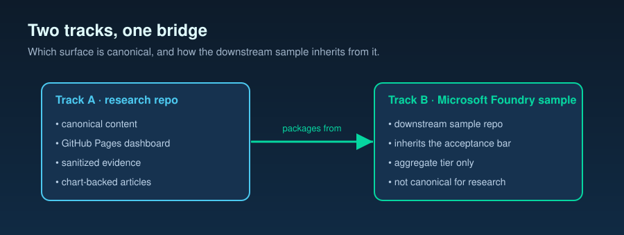

# Foundry packaging relationship — public research repo, Pages, Medium, arXiv, and the downstream Azure AI Foundry sample



**Companion to `docs/16-release-tiers-and-redaction-policy.md`.** That
document defines the three release tiers (`RAW_PRIVATE`,
`SANITIZED_PUBLIC`, `AGGREGATE_AZURE_SAMPLE`), the redaction rules,
the raw-data preservation rule, and the per-surface tier permission
matrix. This document defines the *channel relationships* downstream
of those tiers: how the public research repo, the GitHub Pages
dashboard / blog, Medium syndication, an optional arXiv manuscript,
and the downstream Azure AI Foundry sample repo relate to each other;
which surface is canonical for which kind of content; and the
acceptance bar each surface inherits. It does not author essays,
stand up Pages, post to Medium, submit to arXiv, or package the
Foundry sample; it fixes the relationship contract.

---

## 1. Two tracks, five surfaces

Two downstream tracks: **Track A — public research repo** (this
repo, made public; methodology, hypothesis ledger, decision tools,
citation taxonomy, sanitized benchmark slices) and **Track B —
downstream Azure AI Foundry sample repo** (separately named,
separately governed; Foundry-conformant structure, aggregate-only
data, runnable notebooks cross-linked to public Azure documentation).

Within Track A, three publication surfaces: **GitHub Pages dashboard
/ blog** (canonical for essays and chart series), **Medium**
(derivative reach channel), and **optional arXiv** (distinct
scholarly artifact). Five surfaces total. Each has a defined tier
allowance (`docs/16-release-tiers-and-redaction-policy.md` §4) and a
defined channel role (this document).

```
   private working tree (raw archive + redaction rules)
            │                              │
   SANITIZED│                              │AGGREGATE
            ▼                              ▼
   Track A — public          Track B — Azure AI Foundry
   research repo             sample repo (downstream)
       │ canonical                ▲ cites
       ▼                          │
   GitHub Pages dashboard / blog ─┘
       │  canonical-URL back-link
       ├──▶ Medium (derivative)
       └──▶ arXiv (optional, distinct manuscript)
```

---

## 2. Track A ↔ Track B invariants

1. **Track B never sources from the private working tree.** It
   sources from Track A (`SANITIZED_PUBLIC` re-aggregated to
   `AGGREGATE_AZURE_SAMPLE`) or from a designated
   `AGGREGATE_AZURE_SAMPLE` export first published on Track A.
2. **Track A is the source of methodological truth.** Methodology,
   hypothesis ledger, decision tools, citation taxonomy, and
   per-request evidence live on Track A; Track B packages decisions
   and aggregates for operators and cross-links to Track A for depth.
3. **One-way propagation.** Methodology changes land on the private
   working tree → Track A → Track B (never reversed). Track B may
   evolve its Foundry packaging independently as long as no
   methodology drift is introduced.
4. **Bidirectional citation cross-link.** Track A's public-facing
   pages name the Foundry sample repo as the operator-facing
   downstream product; Track B's `README.md` and `PROVENANCE.md`
   name the Track A repo and the pinned upstream commit SHA.

---

## 3. Track B — Foundry sample acceptance bar

- Microsoft sample-repo `LICENSE` (verified with the Foundry samples
  program at packaging time); Microsoft Open Source
  `CODE_OF_CONDUCT.md`; `SECURITY.md` pointing at the Microsoft MSRC
  vulnerability disclosure flow.
- `README.md` structured per the Foundry sample template (overview →
  prerequisites → run → expected outputs → cleanup → next steps →
  links to public Azure documentation).
- Notebook(s) runnable end-to-end on Azure AI Foundry with a pinned
  dependency manifest; no undeclared local-toolchain assumptions.
- Per-file `SPDX-License-Identifier` headers; no reference to private
  customer engagements, private communication channels, or private
  task identifiers.
- `AGGREGATE_AZURE_SAMPLE` data only; per-request rows are forbidden.
- `PROVENANCE.md` linking back to the Track A public research repo at
  the pinned upstream commit SHA.

Track A and Track B licenses are independently chosen but MUST be
mutually compatible; license selection happens before Track B
packaging starts.

---

## 4. Track A — GitHub Pages dashboard / blog (canonical channel)

The Pages site is the **canonical source of truth** for every
public-facing essay, analysis writeup, chart series, and numeric
claim attached to Track A. Every other public channel (Medium,
arXiv, talk slides, social posts) is a derivative. Updates to a
public claim land on Pages and the public research repo first;
downstream channels follow.

### 4.1 Tier boundary

Consumes **only** `SANITIZED_PUBLIC` and `AGGREGATE_AZURE_SAMPLE`;
`RAW_PRIVATE` MUST NOT appear in any page, chart series, shipped
data file, analytics payload, embedded JSON, or source map. The
build MUST fail if any input lacks a tier label, carries
`RAW_PRIVATE`, or fails the redaction-detector CI job. The site MUST
NOT introduce a new tier, relabel artifacts, or bypass the redaction
rules.

### 4.2 i18n-first requirements

- **Locales (initial set):** `ko`, `en`, `ja`, `zh-CN`, `hi`. "Indian
  language" is represented by **Hindi (`hi`)**; additional Indian
  languages are added later only by explicit owner decision through a
  separate task.
- **Locale-stable routes.** Every page is reachable at a locale-
  prefixed path (`/en/...`, `/ko/...`, `/ja/...`, `/zh-cn/...`,
  `/hi/...`); the locale prefix is part of the canonical URL. The
  unprefixed path either redirects to a chosen default locale or
  renders a locale picker, but does not serve translated content
  from an unprefixed route.
- **`hreflang` and canonical metadata.** Every page emits
  `<link rel="alternate" hreflang="…">` for every available locale,
  plus `hreflang="x-default"`, plus `<link rel="canonical">` to the
  current locale's URL; build fails on missing entries.
- **Translation status metadata.** Each translation carries status
  (`translated`, `machine_translated`, `stale`,
  `untranslated_fallback_to_en`) and a `last_translated_at`
  timestamp; status is surfaced visually (banner) when not
  `translated`.
- **Source-content hash (drift guard).** Each canonical content unit
  carries a stable content hash recorded at translation time; build
  CI compares the live source hash to the stored hash and marks the
  translation `stale` on mismatch.
- **Shared chart data, localized labels.** Chart series data files
  are **locale-agnostic** (numeric series + metric / dimension keys);
  per-locale label bundles supply axis titles, legends, tooltips,
  units, number / date formatting. One dataset, N label bundles.
- **Glossary (terminology lock).** The site ships a glossary covering
  at minimum **Foundry**, **PTU**, **PAYG**, **reasoning**, **cache**,
  **429**, with a fixed per-locale translation; in-text term
  renderings link to glossary entries.

---

## 5. Track A — Medium syndication (derivative channel)

Each Medium post MUST:

- Set Medium's canonical URL field to the corresponding Pages article
  URL, and include in-body links to that Pages article and to the
  public research repo.
- Introduce **no new claims, no new data series, no new charts, no
  new numbers**, and no evidence beyond what already appears in the
  Pages article and the public research repo at the published commit
  SHA. Medium is a re-presentation, not a new evidence channel.
- Carry no `RAW_PRIVATE` content, no customer-shape fingerprints, no
  deployment names, no endpoint URLs, no request IDs, no regions, no
  internal hostnames, no workload-identifying names, and no secret
  patterns; the tier boundary applies in full.
- Record in a visible footer the Pages article URL, the Pages article
  commit SHA, and a `source_hash` (the same drift-detection hash
  mechanism used by the dashboard subtrack), so a future check can
  detect Medium ↔ Pages divergence and either re-sync or flag the
  post as stale.

---

## 6. Track A — Optional arXiv manuscript (distinct scholarly artifact)

arXiv MAY be used as a scholarly preprint channel **only if** the
work is reframed as a refereeable scientific contribution — distinct
from a blog essay — carries sanitized reproducible evidence (Track A
public-tier artifacts; no `RAW_PRIVATE`), and is authored as a
distinct manuscript rather than a paste of Medium / Pages copy.

- **Distinct manuscript.** Own abstract, methods, evidence,
  limitations, references, and (where applicable) appendices.
  Substantial verbatim duplication of blog / Pages text is
  prohibited; overlapping framing is allowed only at the summary
  level (motivation, definitions), not at evidence / analysis.
- **Evidence pinned.** All cited evidence MUST resolve to public
  research repo artifacts at a specific commit SHA; figures and
  tables are regenerated from public-tier artifacts.
- **Bidirectional citation.** The manuscript cites the public
  research repo and the Pages site; the Pages site links back to the
  arXiv preprint once posted.
- **Language and format.** English full version is the submission;
  TeX / LaTeX preferred (PDF-only only when TeX is genuinely
  unavailable). Locale translations remain on the Pages surface.
- **Submission license.** Chosen at submission time and grants arXiv
  an irrevocable right to distribute the work; reviewed against the
  public research repo license before submission.
- **Author registration / endorsement.** A first submission to a
  given subject category may require endorsement; the implementing
  task confirms current status before drafting starts.
- **Ancillary files.** Public-tier artifacts only; subject to the
  same redaction-detector pass as any other public-tier publication.

---

## 7. Channel-relationship invariants (summary)

1. **Pages is canonical.** Public-facing essays, analyses, chart
   series, and numeric claims land on Pages first (and on the public
   research repo first for code / data); every other channel is a
   derivative.
2. **Medium is a derivative-only re-presentation.** No new evidence;
   canonical URL set to Pages; `source_hash` footer for drift
   detection.
3. **arXiv is a distinct scholarly artifact.** Not a paste of blog
   text; own structure; bidirectional citation; English full version;
   ancillary files limited to public-tier artifacts.
4. **Foundry sample is the operator-facing downstream product.**
   `AGGREGATE_AZURE_SAMPLE` only; one-way propagation from the public
   research repo to the Foundry sample repo.
5. **All five surfaces inherit** the tier permissions and redaction
   rules defined in `docs/16-release-tiers-and-redaction-policy.md`.

---

## 8. Citation and DOI plan (at minimum)

For each public publication of substance, the implementing task
names a citation plan covering: the public research repo by URL +
commit SHA; the Pages article by its locale URL; the arXiv preprint
by arXiv ID once posted; an archived-release DOI path so external
citations have a stable target independent of the Pages URL; the
Foundry sample repo by URL + commit SHA where referenced.

---

## 9. Relationship to other documents

- `docs/16-release-tiers-and-redaction-policy.md` — tier definitions,
  redaction rules, raw-data preservation, per-surface tier permission
  matrix, governance / readiness checklist.
- `docs/05-methodology.md` (frozen) — not modified; Track B does not
  author methodology and cites the public research repo for depth.
- `docs/14-observability-schema.md` — record fields whose tier
  classification lives in `docs/16-release-tiers-and-redaction-policy.md` §3.
- `docs/15-spec-vs-inference-taxonomy.md` — every published artifact
  carries both a claim-authority label and a release tier label.
